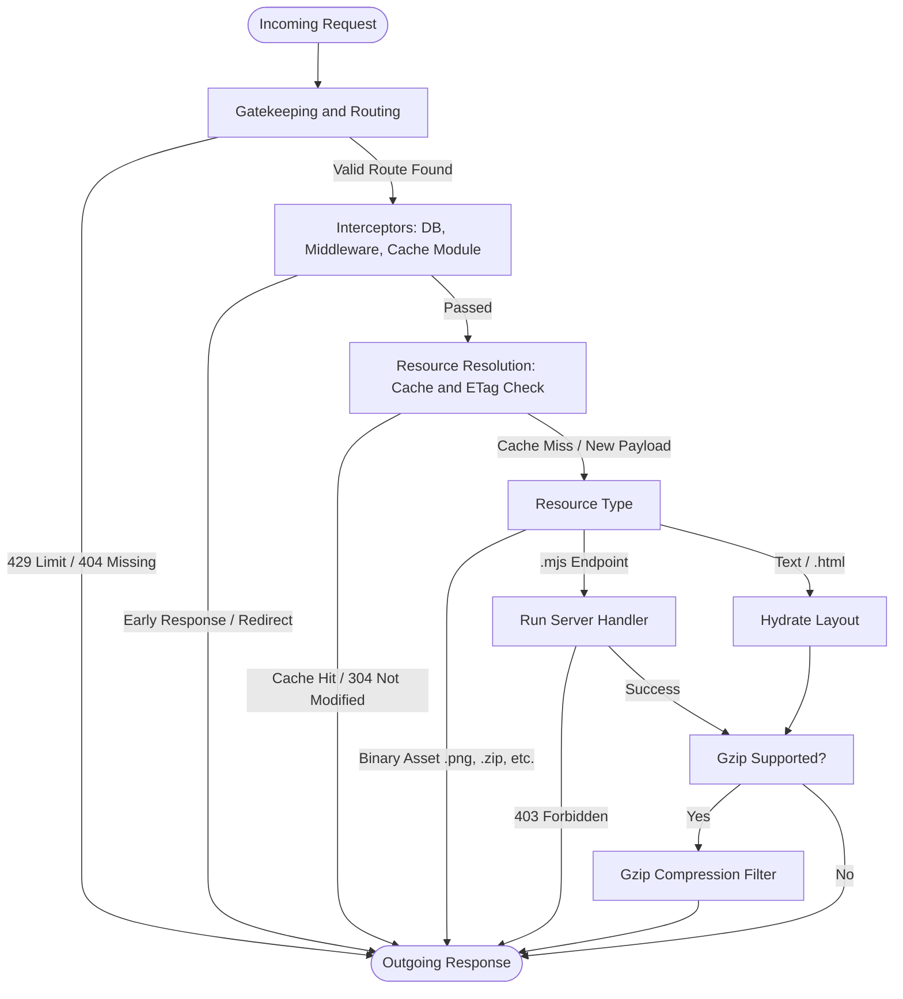
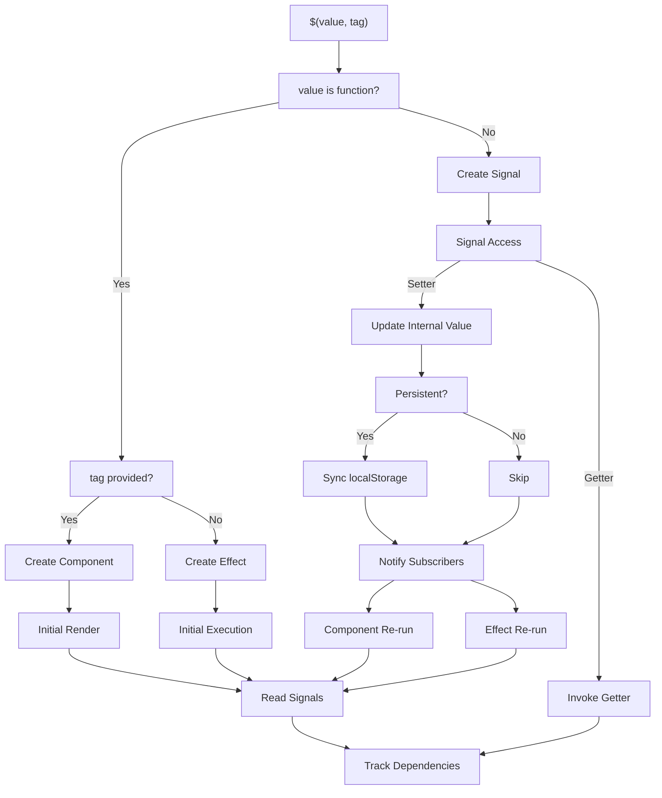
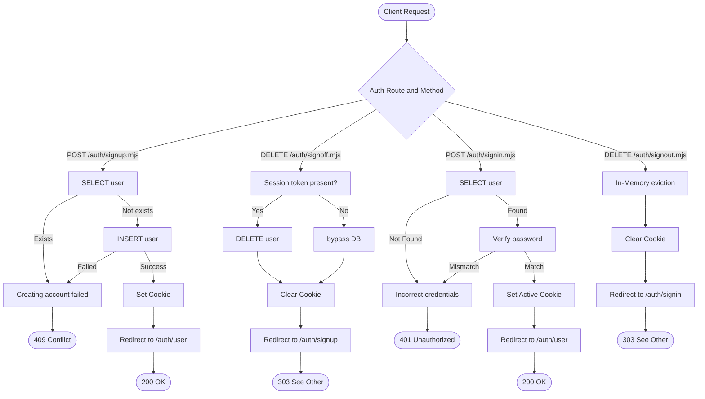

<picture>
  <source media="(prefers-color-scheme: dark)" srcset="https://raw.githubusercontent.com/sedativjs/sedativ-docs/main/src/assets/sedativ-logo-light.svg"/>
  <source media="(prefers-color-scheme: light)" srcset="https://raw.githubusercontent.com/sedativjs/sedativ-docs/main/src/assets/sedativ-logo-dark.svg"/>
  
</picture>

<br><br><br>

If you remember the good old days of jQuery, you may recall a pattern like this:

```js
$("div").text("Hello World");
```

Well, this time we will use `$()` to set reactive components on the client side:

```js
$(ref => html`<div>Hello Kitty</div>`, 'hello-kitty')
```

We will also use `$()` to create endpoint handlers on the server side:

```js
$(res => new Response('Hello Kitty'))
```

Sounds interesting? Let me introduce Sedativ — a full-stack framework for developers sick of fool-stuck frameworks.

# Intro

Instead of selling heavy abstractions, this documentation aims to explain exactly how the framework operates internally, under the hood, line by line. Most frameworks document surface-level features; here you get the underlying mechanics, and this is basically an executable specification, not black-box bloatware with a "convention over comprehension" attitude.

Sedativ requires only **Deno** (v2.6.0 or newer) and a browser that supports **Web Components** (from 2020 onward). Aside from Deno itself, it is completely **dependency-free**. It does not use external packages or third-party tools (such as Vite), yet it still provides the capabilities you can expect.

In around **300 lines of code**, you get:

- File-based routing with dynamic segments
- Automatic request parsing
- Static file streaming and Gzip compression
- API endpoint handling and middleware queue
- Server-side and client-side caching
- IP-based rate limiting
- Automatic security headers
- Hot reloading during development
- Reactive signal-based front-end engine
- Client-side routing with link preloading

This way Sedativ is functionally comparable to tools like:

- Astro + Lit
- Next.js / React
- Nuxt / Vue.js
- SvelteKit / Svelte
- SolidStart / Solid

___

The entire framework is driven by 8 functions (6 server-side and 2 client-side):

`resolveRoute(pathname)`: Matches URL paths to files inside `src` folder and extracts trailing segments as dynamic parameters.

`resolveRequest(request)`: Parses HTTP requests into clean objects containing query parameters, cookies, and decoded bodies.

`resolveRuntime(req, cache, stat)`: Evaluates `.mjs` server handlers, injects client runtime scripts into `.html` files, or loads static assets.

`resolveResource(req, cache)`: Reads files from disk, calculates ETag and cache headers, and keeps small assets in memory.

`resolveResponse(request)`: The main HTTP entrypoint that handles rate limiting, middleware, endpoint execution, and Gzip compression.

`resolveReload(timer, clients)`: Watches `src` folder for file changes in development mode and sends a WebSocket signal to reload the browser.

`reifier(value, tag, effects, range)`: The client-side engine that manages reactive signals and registers custom `Web Components`.

`router()`: Drives single-page navigation, preloading component modules on link hover and managing browser history.

___

Sedativ uses a static-first, island-based, progressively enhanced web architecture - the server handles API endpoints and streams static files, while the client hydrates reactive components asynchronously. Static pages remain identical for all users, while hydrated components manage individual state.

This single, predictable rendering strategy means you do not have to choose between:

\- ~~Client-Side Rendering~~\
\+ No initial DOM created by JS; HTML exists and works without JS layers\
\- ~~Server-Side Rendering~~\
\+ No per-request rendering engine or server-side component logic execution\
\- ~~Single Page Application~~\
\+ No single application root requirement or mandatory JS navigation\
\- ~~Incremental Static Regeneration~~\
\+ No background regeneration tasks or complex revalidation logic\
\- ~~Deferred Static Generation~~\
\+ No page generation latency delays on the first incoming user request\
\- ~~Partial Hydration~~\
\+ No DOM reconciliation processes or duplicate server-rendered markup\
\- ~~Resumability~~\
\+ No massive serialized execution state transfers needed to resume execution\
\- ~~Server Actions~~\
\+ No UI mutations modeled as custom server functions or server-driven template re-renders\
\- ~~Server Components~~\
\+ No component execution graphs split artificially between environments, no heavy RSC pipelines

___

Sedativ leverages web platform standards instead of reinventing them, avoiding vendor-locked tooling or custom languages.

On the client, it provides a light wrapper over standard Web Components to add reactivity and shifting module resolution entirely to the browser instead of relying on a heavy build pipeline.

On the server, it mirrors client-side API design with standard Response objects, keeping routing and endpoint logic clean while operating close to the Deno runtime.

Sedativ enforces a strict separation of concerns - you always know where code executes just by checking the file extension.

The idea is simple:

***.mjs*** **files run on the server side and have direct access to the parsed request** ***req***:

```js
// sample-endpoint.mjs

// import whatever you want:
import data from './data.json' with { type: 'json' }
// create api handler:
$(req => {
  // use parsed Request:
  const { method, body } = req
  if (method === 'POST') {
    // return native Response:
    return new Response(
      JSON.stringify({ body, data, redirect: '/' }),
      { status: 200, statusText: 'OK', headers: { 'content-type': 'application/json' } }
    )
  }
})
```

***.js*** **files run on the client side and have direct access to the component reference** ***ref***:

```js
// sample-component.js

// create reactive signal:
const count = $(0)
// define web component:
$(ref => {
  // add template:
  ref.html`
    <button data-action="-">-</button>
    <span>${count()}</span>
    <button data-action="+">+</button>
  `
  // add event:
  ref.onclick = event => {
    const { action } = event.target.dataset
    // change signal value to re-render template:
    action === '-' && count(count() - 1)
    action === '+' && count(count() + 1)
  }
// create web component:
}, 'sample-component')
```

The entire abstraction layer is unified under a single polymorphic function `$` and a router utility `_`. There is no other API to learn, and there will be no breaking changes.

## Table of Contents

- [Intro](#intro)
  - [ Get started](#get-started)

- [Server-side](#server-side)
  - [Initialization](#initialization)
  - [Route](#route)
  - [Request](#request)
  - [Runtime](#runtime)
  - [Resource](#resource)
  - [Response](#response)
  - [Reload](#reload)
  - [Endpoints](#endpoints)
  - [Cache](#cache)
  - [Middleware](#middleware)
  - [DB Integration](#db-integration)
  - [Deployment](#deployment)

- [Client-side](#client-side)
  - [Reifier](#reifier)
  - [Rendering](#rendering)
  - [Reactivity](#reactivity)
  - [Referencing](#referencing)
  - [Router](#router)
  - [Standalone](#standalone)

- [Tutorial](#tutorial)
  - [Shared data](#shared-data)
  - [Sign Up](#sign-up)
  - [Sign Off](#sign-off)
  - [Sign In](#sign-in)
  - [Sign Out](#sign-out)

## Get Started

### Install Deno

Sedativ is a Deno-native framework. If you do not have Deno installed on your machine yet, open your terminal and execute the command for your operating system:

```shell
# Windows:
irm https://deno.land/install.ps1 | iex

# Linux/MacOS
curl -fsSL https://deno.land/install.sh | sh
```

Ensure your installation is updated to at least version 2.6.0 by running `deno --version`.

### Initialize Project

```
main.mjs
src/
└─ index.html
```

To start a new full-stack project, you only need two files (everything else is optional):

- `main.mjs`: The application entry point.

- `index.html`: Standard HTML structure placed inside the `src` folder.

This is literally all it takes:

- No CLI initializers or complex scaffolding tools.

- No external packages to install bloating your disk.

### Run Server

```shell
deno serve -A --env-file --watch main.mjs
```

To spin up the server locally, navigate to your project's root directory and execute `deno serve`:

`deno serve`: Uses Deno's native server runner, binding an HTTP server directly to the fetch handler exported by `main.mjs`.

`-A`: Grants permissions to bind network ports, read files from disk, and listen to filesystem events.

`--env-file`: Automatically loads environment variables from a root `.env` file into `Deno.env`.

`--watch`: Restarts the server process instantly whenever modifications are saved in any script or asset.

The server entrypoint `main.mjs` uses a single port (`8000` by default) to handle both:

- **Application Traffic**: Standard HTTP requests pass directly into `resolveResponse(req)` for file streaming, component rendering, and API evaluation.

- **Live Reload Traffic**: In development mode (`config.isDev`), requests targeting `/_reload` are intercepted and upgraded to a WebSocket connection, instantly reloading the browser whenever a file is saved.

```js
// main.mjs
export default { 
  fetch: request => request.url.endsWith('/_reload') && reloadServer ? reloadServer(request) : resolveResponse(request) 
}
```

There are no separate `dev`, `build`, or `preview` scripts. Sedativ uses raw JavaScript modules, meaning:

- No bundler is involved.

- Build time is **0ms**.

- Your source code is already production code.

Framework behavior is controlled via the `DENO_ENV` environment variable:

| Feature | Development Mode | Production Mode |
| :--- | :--- | :--- |
| Routing Cache | Disabled (Live file reads on every request) | Enabled (Warm module cache for peak throughput) |
| Live Reload | Enabled (Auto-refreshes browser on save) | Disabled (Route ignored to eliminate socket overhead) |
| Performance Profile | Optimized for instant iteration | Optimized for raw delivery |

### Add Environment Variables

By default, the server runs in Development Mode. To switch to Production Mode, set `DENO_ENV=production` inside a `.env` file in your project root:

```shell
# .env
DENO_ENV=production
```

When launching the server, ensure the `--env-file` flag is included so Deno reads these values on startup.

⚠️ Ensure `.env` is listed in `.gitignore` to prevent committing environment files to source control.

### Setup Tooling

Sedativ uses native JavaScript template literals for HTML components. To enable syntax highlighting inside template literals, install an extension such as [es6-string-html](https://marketplace.visualstudio.com/items?itemName=Tobermory.es6-string-html) in VS Code or an equivalent plugin for your chosen text editor. This will highlight HTML markup written inside JavaScript string templates.

Sedativ is extremely compact, so its entire architectural footprint should fit into a single LLM context window. If you are using an AI to help build features, simply append `main.mjs` file directly to a prompt context. Because there is no hidden abstraction or proprietary layers, the AI should understand framework's exact mechanics precisely.


# Server-side

Every incoming request passes through a streamlined, automated execution pipeline:



The server maps requests directly to physical files inside the `src/` directory, processing them through lightweight interceptors while optimizing performance with automatic ETag validation and on-the-fly Gzip compression.

- **Zero-Configuration Routing**: `src/` folder structure dictates application's URLs. There are no routing tables, central config manifests, or complex regular expressions to maintain.

- **Parameter Backtracking**: URL parameters are parsed by scanning backward from the end of the web path. If a URL contains extra segments that extend past a physical file on disk, the router stops backtracking, targets that file, and hands the remaining paths as a clean `params` array. This completely eliminates naming hacks like `[id]` or `:id`.

- **Extension-Driven Execution**: File types dictate behavior. A `.mjs` file runs dynamic server-side logic, a `.html` file triggers layout hydration, and binary assets (like images or zip files) are streamed directly to the client.

By containing all routable files strictly within the `src/` directory, configuration files like `deno.json` or `package.json` stay securely isolated at the project root.

## Routing Rules

Given this project structure:

```
main.mjs
src/
├─ index.html
├─ user.html
├─ user.js
├─ user.mjs
└─ user/
   ├─ posts.html
   ├─ posts.js
   └─ posts.mjs
```

The server resolves incoming request URLs to physical files and parameter objects according to these rules:

| Incoming Request URL | Resolved File Route | Params | Query |
| :--- | :--- | :--- | :--- |
| `/` | `./src/index.html` | `[]` | `{}` |
| `/user` | `./src/user.html` | `[]` | `{}` |
| `/user/` | `./src/user.html` | `[]` (trailing slash stripped) | `{}` |
| `/user.html` | `./src/user.html` | `[]` | `{}` |
| `/user.js` | `./src/user.js` | `[]` (served as static text) | `{}` |
| `/user.mjs` | `./src/user.mjs` | `[]` (executed as a dynamic endpoint) | `{}` |
| `/user/posts` | `./src/user/posts.html` | `[]` | `{}` |
| `/user/posts.mjs/1` | `./src/user/posts.mjs` | `[1]` | `{}` |
| `/user/posts.mjs/1/comments/2?sort=new` | `./src/user/posts.mjs` | `['1', 'comments', '2']` | `{ sort: 'new' }` |
| `/user/posts.mjs/1/comments/2?sort=new&sort=top` | `./src/user/posts.mjs` | `['1', 'comments', '2']` | `{ sort: 'top' }` |

## Initialization

```js
const decoder = new TextDecoder(), encoder = new TextEncoder()
const [dbModule, middlewareModule, cacheModule] = await Promise.all([import('./db.mjs'), import('./middleware.mjs'), import('./cache.mjs')]
  .map(path => path.then(module => module.default).catch(error => (console.warn(`\x1b[33mWarning\x1b[0m:`, error.message || error), () => {}))))

const config = {
  isDev: Deno.env.get('DENO_ENV') !== 'production' && !Deno.env.has('DENO_DEPLOYMENT_ID'),
  maxRequestsPerSecond: 100000,
  maxCacheEntries: 1024,
  cacheDuration: 0,
  cacheMaxSize: 1024 * 1024
}
const securityHeaders = {
  'strict-transport-security': 'max-age=31536000; includeSubDomains; preload',
  'x-frame-options': 'DENY',
  'x-content-type-options': 'nosniff',
  'referrer-policy': 'no-referrer',
  'permissions-policy': 'geolocation=(), camera=(), microphone=()'
}

const mimeText = {
  html: 'text/html', css: 'text/css', txt: 'text/plain', csv: 'text/csv', md: 'text/markdown', svg: 'image/svg+xml',
  js: 'application/javascript', mjs: 'application/javascript', cjs: 'application/javascript', json: 'application/json', xml: 'application/xml'
}
const mimeBinary = {
  webp: 'image/webp', png: 'image/png', jpg: 'image/jpeg', gif: 'image/gif', avif: 'image/avif',
  mp3: 'audio/mpeg', wav: 'audio/wav', ogg: 'audio/ogg', aac: 'audio/aac', weba: 'audio/webm',
  mp4: 'video/mp4', mpeg: 'video/mpeg', webm: 'video/webm', ogv: 'video/ogg', avi: 'video/x-msvideo',
  woff2: 'font/woff2', woff: 'font/woff', ttf: 'font/ttf', otf: 'font/otf', eot: 'application/vnd.ms-fontobject',
  pdf: 'application/pdf', zip: 'application/zip', rar: 'application/vnd.rar', tar: 'application/x-tar', gz: 'application/gzip'
}
const parsers = {
  json: request => request.json(),
  form: request => request.formData(),
  multipart: request => request.formData(),
  blob: request => request.arrayBuffer(),
  default: request => request.text()
}

const LRU = (map) => {
  if (!map.hasOwnProperty('get')) {
    map.get = (key) => map.has(key) ? (val => (
      map.delete(key), Map.prototype.set.call(map, key, val), val))(Map.prototype.get.call(map, key)) : undefined
    map.set = (key, val) => (
      map.delete(key), Map.prototype.set.call(map, key, val), map.size > config.maxCacheEntries && map.delete(map.keys().next().value), map)
  } 
  return map
}
const caches = {
  paths: LRU(new Map()),
  routes: LRU(new Map()),
  handlers: LRU(new Map()),
  files: LRU(new Map()),
  ips: LRU(new Map())
}
```

Before accepting network requests, the server evaluates optional architecture extensions, establishes security parameters, and configures in-memory eviction caches.

### Modules Import and Utility

```js
const decoder = new TextDecoder(), encoder = new TextEncoder()
const [dbModule, middlewareModule, cacheModule] = await Promise.all([import('./db.mjs'), import('./middleware.mjs'), import('./cache.mjs')]
  .map(path => path.then(module => module.default).catch(error => (console.warn(`\x1b[33mWarning\x1b[0m:`, error.message || error), () => {}))))
```

`decoder / encoder`: Standard Web APIs used to convert between text strings and raw binary data (Uint8Array).

`Promise.all(...)`: Loads all optional modules in parallel to keep server startup fast.

`[import('./db.mjs'), import('./middleware.mjs'), import('./cache.mjs')]`: Explicit file paths allow Deno to discover and download external dependencies before starting the server.

`path.then(module => module.default)`: Extracts the default exported function from each loaded file.

`.catch(...)`: Logs any loading errors and supplies a fallback empty function `(() => {})`, ensuring the server continues running even if optional modules are missing.

### Configuration and Security Headers

```js
const config = {
  isDev: Deno.env.get('DENO_ENV') !== 'production' && !Deno.env.has('DENO_DEPLOYMENT_ID'),
  maxRequestsPerSecond: 100000,
  maxCacheEntries: 1024,
  cacheDuration: 0,
  cacheMaxSize: 1024 * 1024
}
const securityHeaders = {
  'strict-transport-security': 'max-age=31536000; includeSubDomains; preload',
  'x-frame-options': 'DENY',
  'x-content-type-options': 'nosniff',
  'referrer-policy': 'no-referrer',
  'permissions-policy': 'geolocation=(), camera=(), microphone=()'
}
```

`config`: Defines constraints to control memory allocation and rate limiting.

- `isDev`: Evaluates environment variables to determine if the server is running locally. It returns `true` if the `DENO_ENV` variable is not set to `production` and there is no cloud cloud platform deployment identifier `DENO_DEPLOYMENT_ID`.

- `maxRequestsPerSecond`: The request ceiling allowed from a single IP address during a one-second window before the server denies access with a `429 Too Many Requests` response.

- `maxCacheEntries`: Controls memory growth by limiting individual in-memory cache collections to restrict RAM consumption.

- `cacheDuration`: Sets the millisecond lifespan baseline for downstream client browser storage headers.

- `cacheMaxSize`: Sets a 1 MB limit for individual static assets. Payloads at or below this value are pinned to RAM; larger payloads bypass memory to be streamed directly from the disk.

`securityHeaders`: Specifies declarative security policies appended to outgoing HTTP responses.

- `strict-transport-security`: Restricts browser connections exclusively to encrypted HTTPS for one year.

- `x-frame-options`: Prevents clickjacking by blocking pages from being rendered inside external iframes.

- `x-content-type-options`: Disables automatic MIME-type guessing, forcing the browser to respect explicit content headers.

- `referrer-policy`: Omits the path origin when navigating away to prevent sensitive URL data leakage.

- `permissions-policy`: Disables browser hardware feature access (location, camera, microphone) at the document root.

### MIME Types and Parsers

```js
const mimeText = {
  html: 'text/html', css: 'text/css', txt: 'text/plain', csv: 'text/csv', md: 'text/markdown', svg: 'image/svg+xml',
  js: 'application/javascript', mjs: 'application/javascript', cjs: 'application/javascript', json: 'application/json', xml: 'application/xml'
}
const mimeBinary = {
  webp: 'image/webp', png: 'image/png', jpg: 'image/jpeg', gif: 'image/gif', avif: 'image/avif',
  mp3: 'audio/mpeg', wav: 'audio/wav', ogg: 'audio/ogg', aac: 'audio/aac', weba: 'audio/webm',
  mp4: 'video/mp4', mpeg: 'video/mpeg', webm: 'video/webm', ogv: 'video/ogg', avi: 'video/x-msvideo',
  woff2: 'font/woff2', woff: 'font/woff', ttf: 'font/ttf', otf: 'font/otf', eot: 'application/vnd.ms-fontobject',
  pdf: 'application/pdf', zip: 'application/zip', rar: 'application/vnd.rar', tar: 'application/x-tar', gz: 'application/gzip'
}
const parsers = {
  json: request => request.json(),
  form: request => request.formData(),
  multipart: request => request.formData(),
  blob: request => request.arrayBuffer(),
  default: request => request.text()
}
```

`mimeText`: Maps text-based extensions to their standard media types, establishing an explicit whitelist of files compatible with standard Gzip compression.

`mimeBinary`: Maps binary asset extensions to their respective content types, signaling the engine to bypass text compilation pipelines and stream raw bytes directly.

`parsers`: Maps incoming content-type headers directly to native, asynchronous web-standard body readers, ensuring dependency-free decoding for JSON, form submissions, data streams, and raw text.

### Server Caches and Eviction

```js
const LRU = (map) => {
  if (!map.hasOwnProperty('get')) {
    map.get = (key) => map.has(key) ? (val => (
      map.delete(key), Map.prototype.set.call(map, key, val), val))(Map.prototype.get.call(map, key)) : undefined
    map.set = (key, val) => (
      map.delete(key), Map.prototype.set.call(map, key, val), map.size > config.maxCacheEntries && map.delete(map.keys().next().value), map)
  } 
  return map
}
const caches = {
  paths: LRU(new Map()),
  routes: LRU(new Map()),
  handlers: LRU(new Map()),
  files: LRU(new Map()),
  ips: LRU(new Map())
}
```

`LRU`: A structural wrapper that upgrades standard JavaScript `Map` objects into self-cleaning caches. Because JavaScript Maps preserve the order of item insertion, this function implements a **Least Recently Used** eviction policy using two operations:

- `map.get`: When an item is read, it is removed and immediately appended back to the end of the collection, establishing its freshness.

- `map.set`: Inserts data and places it at the end of the collection. If total entries exceed the `maxCacheEntries` limit, the oldest entry located at the very front of the insertion line `(map.keys().next().value)` is permanently dropped.

`caches`: Dedicated in-memory collections that eliminate repetitive computational overhead:

- `paths`: Stores pre-parsed URL path strings to minimize repeated text parsing routines.

- `routes`: Remembers filesystem routing matches, avoiding directory lookup checks on subsequent requests.

- `handlers`: Keeps ready-to-execute function references derived from compiled `.mjs` endpoints.

- `files`: Holds static file buffers to serve contents without incurring disk storage access penalties.

- `ips`: Tracks timestamp and connection counts grouped by client IP addresses to enforce server rate limits.

## Route

```js
export const resolveRoute = async (pathname) => {
  if (!config.isDev && caches.paths.has(pathname)) return caches.paths.get(pathname)
  const segments = pathname === '/' ? [] : pathname.replace(/\/$/, '').split('/').filter(Boolean)
  for (let depth = segments.length; depth >= 0; depth--) {
    const base = './src' + (depth ? '/' + segments.slice(0, depth).join('/') : '')
    const candidates = depth ? [base, base + '.html'] : ['./src/index.html']
    for (const candidate of candidates) {
      let exists = caches.routes.get(candidate)
      if (exists === undefined) {
        try { exists = (await Deno.stat(candidate)).isFile } catch { exists = false }
        !config.isDev && caches.routes.set(candidate, exists)
      }
      if (exists) {
        const result = { route: candidate, params: segments.slice(depth) }
        return (!config.isDev && caches.paths.set(pathname, result), result)
      }
    }
  }
  const fallback = { route: null, params: [] }
  return (!config.isDev && caches.paths.set(pathname, fallback), fallback)
}
```

`resolveRoute`: Processes incoming URL pathnames by decomposing the path string into individual segments and executing a reverse-directory traversal. This approach avoids heavy regular expression evaluations by checking file existence from the most specific potential path backward to the `./src` root.

### Fast-Path Cache and URL Normalization

```js
if (!config.isDev && caches.paths.has(pathname)) return caches.paths.get(pathname)
const segments = pathname === '/' ? [] : pathname.replace(/\/$/, '').split('/').filter(Boolean)
```

`caches.paths.has(pathname)`: In production mode, the router looks up the raw pathname string in the path cache before performing any string manipulation or file checks. If a match is found, the pre-resolved route and parameter configuration object are returned instantly.

`pathname.replace(/\/$/, '')`: Standardizes incoming URLs by stripping out trailing slashes to prevent duplicate path keys.

`split('/').filter(Boolean)`: Breaks the URL into a clean array of text segments, discarding empty values caused by multiple consecutive slashes.

- If the path is `/users/123/posts/`, segments becomes `['users', '123', 'posts']`.

- If the path is just the root `/`, it resolves to an empty array `[]`.

### Directory Traversal and Candidate Construction

```js
for (let depth = segments.length; depth >= 0; depth--) {
  const base = './src' + (depth ? '/' + segments.slice(0, depth).join('/') : '')
  const candidates = depth ? [base, base + '.html'] : ['./src/index.html']
```

`for (let depth = segments.length; ...)`: A descending loop that reads the path segments backward. This guarantees that deeply nested files take execution priority over top-level parent routes.

`base`: Reconstructs the directory path at the current loop depth, forcing all checks to remain scoped strictly inside the `./src` folder. For a URL path of `/user/123/posts`:

- At depth 3, base is `./src/user/123/posts`

- At depth 2, base is `./src/user/123`

- At depth 1, base is `./src/user`

- At depth 0, base defaults to `./src`

`candidates`: An array defining the target files checked on the file system during the current iteration. The router checks for a clean file match first, followed by an `.html` file variation. If the loop reaches depth 0, it falls back to checking for the default root entry point `./src/index.html`.

- URL `/user.js` is mapped to `./src/user.js` file

- URL `/user` is mapped to `./src/user.html` file

- URL `/` is mapped to `./src/index.html` file

### Filesystem State Verification

```js
for (const candidate of candidates) {
  let exists = caches.routes.get(candidate)
  if (exists === undefined) {
    try { exists = (await Deno.stat(candidate)).isFile } catch { exists = false }
    !config.isDev && caches.routes.set(candidate, exists)
  }
```

`caches.routes.get(candidate)`: Inspects the route memory map to see if the file status of the candidate path is already known.

`Deno.stat(candidate)`: If the cache returns `undefined`, the server directly queries the operating system to confirm whether the candidate path exists on disk and is a valid file. If the file is missing or inaccessible, the error is caught safely, and `exists` is set to `false`.

`caches.routes.set(...)`: In production, the boolean result of the file check is saved to memory. Subsequent requests for this path skip the file system completely, avoiding disk reading.

### Match Finalization and Parameter Extraction

```js
    if (exists) {
      const result = { route: candidate, params: segments.slice(depth) }
      return (!config.isDev && caches.paths.set(pathname, result), result)
    }
  }
}
const fallback = { route: null, params: [] }
return (!config.isDev && caches.paths.set(pathname, fallback), fallback)
```

`params: segments.slice(depth)`: When a candidate file is confirmed to exist, the traversal stops. Any remaining URL segments located to the right of the matched file depth index are extracted as dynamic parameters. For example, if `/user/123/posts` matches a physical file at `./src/user.html` (depth 1), the remaining segments `['123', 'posts']` are captured into the params array.

`caches.paths.set(pathname, result)`: Saves the completed resolution object into the path cache in production mode, ensuring future identical requests resolve with an $O(1)$ lookup speed.

`fallback`: If the loop finishes without finding a physical file match inside the `./src` folder, the function returns a null-route configuration, signaling the execution engine to issue a standard `404 Not Found` response downstream.

## Request

```js
export const resolveRequest = async (request) => {
  const { method, headers, url } = request
  const { pathname, searchParams } = new URL(url)
  const { route, params } = await resolveRoute(pathname)

  const ext = route ? route.split('.').pop() || '' : ''
  const mime = mimeText[ext] || mimeBinary[ext] || 'application/octet-stream'
  const type = Object.keys(parsers).find(type => headers.get('content-type')?.includes(type)) || 'default'

  const query = Object.fromEntries(searchParams)
  const cookies = Object.fromEntries((headers.get('cookie') || '').split('; ').filter(Boolean).map(c => (c.includes('=') ? c : c + '=').replace('=', '\x00').split('\x00')))
  const body = request.body ? await parsers[type](request).catch(() => parsers.default(request)) : ''

  return { method, headers, url, pathname, ext, mime, type, route, params, query, cookies, body, locals: {} }
}
```

`resolveRequest`: Normalizes a standard incoming web Request object into a uniform object containing all necessary execution metadata.

### Method, Headers, Url, Pathname, Route, Params

```js
const { method, headers, url } = request
const { pathname, searchParams } = new URL(url)
const { route, params } = await resolveRoute(pathname)
```

`method, headers, url`: Extracted directly from the standard incoming network request object via object destructuring.

`new URL(url)`: Uses the standard web URL utility to parse the full location string into individual components.

`pathname`: Isolates the clean path string (such as `/user/profile`) while stripping away any trailing URL query parameters.

`resolveRoute(pathname)`: Invokes the file-system router using the extracted path to locate a physical matching asset within the `./src` directory.

`route, params`: Captures the validated disk path string and populates the `params` array with any remaining trailing URL elements left over from the `route` match.

### Extension, Mime, Type

```js
const ext = route ? route.split('.').pop() || '' : ''
const mime = mimeText[ext] || mimeBinary[ext] || 'application/octet-stream'
const type = Object.keys(parsers).find(type => headers.get('content-type')?.includes(type)) || 'default'
```

`ext`: Finds the target file extension by splitting the resolved route string by its periods and taking the final element. If the route has no extension or is missing, it returns an empty string.

`mime`: Checks the isolated extension against the internal text and binary dictionaries to assign a matching content type header. If the extension is unrecognized, it defaults to `application/octet-stream`.

`type`: Scans the keys of the configured request body parsers to see if any match the string value inside the incoming `content-type` header. If the header is missing or unsupported, it falls back to the `'default'` string identifier.

### Query, Cookies, Body

```js
const query = Object.fromEntries(searchParams)
const cookies = Object.fromEntries((headers.get('cookie') || '').split('; ').filter(Boolean).map(c => (c.includes('=') ? c : c + '=').replace('=', '\x00').split('\x00')))
const body = request.body ? await parsers[type](request).catch(() => parsers.default(request)) : ''
```

`query`: Packs the URL search keys and values into a standard flat object using `Object.fromEntries()`.

`cookies`: Parses the incoming HTTP Cookie header string into a key-value object. It splits cookies using a `;`  spacer, discards empty entries, ensures each item contains an assignment operator `=`, replaces the first `=` with a hidden null-byte character `(\x00)`, and splits on that null byte. This isolates cookie names from their values safely without using regular expression.

`body`: Evaluates if the incoming request contains an active body data stream. If present, it executes the corresponding content parser. If the payload stream reading fails or is malformed, the `.catch()` block intercepts the failure and returns a plain text string instead.

### Locals, Context Assembly

```js
return { method, headers, url, pathname, ext, mime, type, route, params, query, cookies, body, locals: {} }
```

`locals`: An empty object literal generated fresh for every request. This property creates an isolated workspace where custom middleware functions or database interceptors can store data (like user account items) across the lifespan of the request.

`return { ... }`: Aggregates the raw HTTP details, filesystem targets, structural route arrays, query variables, cookie records, decoded bodies, and local objects into a single, uniform request context passed to downstream handlers.

## Runtime

```js
export const resolveRuntime = async (req, cache, stat) => {
  if (req.ext === 'mjs') {
    if (!config.isDev && caches.handlers.has(req.route)) return caches.handlers.get(req.route)
    const folderUrl = `file://${Deno.cwd().replace(/\\/g, '/')}/${req.route.replace('./', '')}`.replace(/\/[^/]+$/, '/')
    const scriptSrc = (await Deno.readTextFile(req.route))
      .replace(/(from\s+['"])(\.\.?\/[^'"]+)(['"])/g, (_, prefix, importPath, suffix) => prefix + new URL(importPath, folderUrl).href + suffix)
      .replace(/\$\s*\(/, 'export default (')
    const blobUrl = URL.createObjectURL(new Blob([scriptSrc], { type: 'application/javascript' }))
    try {
      const handler = (await import(blobUrl)).default
      return (!config.isDev && caches.handlers.set(req.route, handler), handler) }
    catch (err) { return null }
    finally { URL.revokeObjectURL(blobUrl) }
  }

  if (req.ext === 'html') return encoder.encode((await Deno.readTextFile(req.route)).replace('</title>', `</title>
    <script>globalThis.req = ${JSON.stringify({ params: req.params, query: req.query, locals: req.locals })}</script>
    <script type="module">export let reifier = ${reifierSrc}; globalThis.$ = reifier; export let router = (${routerSrc})(); globalThis._ = router</script>
    <script>${config.isDev ? reloadClient : ''}</script>
  `))

  return stat.size <= cache.maxSize ? await Deno.readFile(req.route) : (await Deno.open(req.route)).readable
}
```

`resolveRuntime`: Determines how a requested source file is read and executed based on its file extension. It evaluates three distinct file categories: `.mjs` endpoints, `.html` layouts, and static assets.

### MJS Compilation

```js
if (req.ext === 'mjs') {
  if (!config.isDev && caches.handlers.has(req.route)) return caches.handlers.get(req.route)
  const folderUrl = `file://${Deno.cwd().replace(/\\/g, '/')}/${req.route.replace('./', '')}`.replace(/\/[^/]+$/, '/')
  const scriptSrc = (await Deno.readTextFile(req.route))
    .replace(/(from\s+['"])(\.\.?\/[^'"]+)(['"])/g, (_, prefix, importPath, suffix) => prefix + new URL(importPath, folderUrl).href + suffix)
    .replace(/\$\s*\(/, 'export default (')
  const blobUrl = URL.createObjectURL(new Blob([scriptSrc], { type: 'application/javascript' }))
  try {
    const handler = (await import(blobUrl)).default
    return (!config.isDev && caches.handlers.set(req.route, handler), handler) }
  catch (err) { return null }
  finally { URL.revokeObjectURL(blobUrl) }
}
```

`if (req.ext === 'mjs')`: Intercepts JavaScript files meant to run on the server, modifying their source code in memory before execution.

`caches.handlers.has(req.route)`: In production mode, skips file reading entirely if this backend file has been compiled and saved into memory previously.

`folderUrl`: Computes an absolute file URL pointing directly to the folder containing the file. This acts as a reference point so any relative paths inside the file still work correctly during virtual execution.

`scriptSrc`: Pulls the raw source code string from disk into memory.

- **Module Path Resolution**: The first `replace()` statement converts relative import paths into absolute file URLs using the calculated base path. This prevents path resolution failures when the code executes from a temporary Blob URL.

- **Syntax Transformation**: The second `replace()` statement converts the custom shorthand notation into a valid ECMA-compliant export statements.

`blobUrl`: Wraps the modified source code string inside a temporary web address `blobUrl` that the engine can read like a normal physical file.

`handler`: Loads the temporary web address into the running application, executing the backend code and grabbing its default exported function to use as the request handler.

`URL.revokeObjectURL(blobUrl)`: Immediately cleans up and deletes the temporary web address from memory once the import completes to avoid memory leaks.

### HTML Hydration

```js
if (req.ext === 'html') return encoder.encode((await Deno.readTextFile(req.route)).replace('</title>', `</title>
  <script>globalThis.req = ${JSON.stringify({ params: req.params, query: req.query, locals: req.locals })}</script>
  <script type="module">export let reifier = ${reifierSrc}; globalThis.$ = reifier; export let router = (${routerSrc})(); globalThis._ = router</script>
  <script>${config.isDev ? reloadClient : ''}</script>
`))
```

`if (req.ext === 'html')`: Catches requests for HTML pages, reads the document text, and injects configuration scripts directly into the document.

`encoder.encode(...)`: Converts the completed HTML text string back into a raw binary data array (Uint8Array) so the network can transmit it.

`replace('</title>', ...)`: Uses the document's closing title tag as a safe marker to inject the application's base frontend scripts.

`globalThis.req = { ... }`: Takes the server-side parameters, search variables, and custom local data, turns them into a JSON string, and exposes them directly to the browser window. This makes backend context instantly readable by frontend elements without requiring an extra API call.

`globalThis.$ = reifier`: Injects the complete client-side reactivity engine `reifierSrc` making reactive state management available everywhere on the page.

`globalThis._ = router`: Injects the complete client-side single-page router `routerSrc` and runs it immediately to take over standard browser navigation and links.

`${config.isDev ? reloadClient : ''}`: Checks the server environment profile. If local development is active, injects a background WebSocket script that reloads the browser tab automatically when a project file changes.

### Static Asset Delivery

```js
return stat.size <= cache.maxSize ? await Deno.readFile(req.route) : (await Deno.open(req.route)).readable
```

`stat.size <= cache.maxSize`: Evaluates whether the requested static asset file size is equal to or smaller than the safety threshold.

`Deno.readFile(req.route)`: Used for smaller assets. Reads the entire file directly into RAM at once to fulfill the request as quickly as possible.

`Deno.open(req.route)`: Used for larger assets. Bypasses server memory completely by opening a raw read stream directly from the disk, safely passing large payloads like videos or zip archives out to the network in fragments.

## Resource

```js
export const resolveResource = async (req, cache) => {
  const now = Date.now()
  let resource = caches.files.get(req.route)
  if (resource?.content && resource?.expires > now) return resource

  const stat = await Deno.stat(req.route)
  const cacheControl = cache.duration > 0 ? `public, max-age=${Math.floor(cache.duration / 1000)}, must-revalidate` : 'no-store'
  const etag = `W/"${stat.mtime.getTime()}-${stat.size}${cache.duration > 0 ? `-${Math.floor(now / cache.duration)}` : ''}"`
  const expires = now + cache.duration
  const headers = { 'content-type': req.mime, 'cache-control': cacheControl, 'etag': etag, ...securityHeaders, ...(config.isDev ? { 'expires': '0' } : {}) }
  
  const content = await resolveRuntime(req, cache, stat)
  resource = { expires, headers, content }
  return ((!config.isDev && cache.duration > 0 && stat.size <= cache.maxSize) && caches.files.set(req.route, resource), resource)
}
```

`resolveResource`: Fetches files from disk or internal memory, builds HTTP response headers, and determines if an asset can be served from memory.

### Server Memory Cache Lookup

```js
const now = Date.now()
let resource = caches.files.get(req.route)
if (resource?.content && resource?.expires > now) return resource
```

`now`: Captures the current millisecond timestamp used to evaluate cache lifetime expiration.

`caches.files.get(req.route)`: Queries the internal server memory map for a previously saved resource using the route path as the key.

`resource?.content`: Verifies that the cached entry exists and contains valid file payload data.

`resource?.expires > now`: Checks if the cached item is still within its valid lifetime. If true, the server returns the cached resource immediately, skipping disk access and compilation.

### File Metadata and Header Generation

```js
const stat = await Deno.stat(req.route)
const cacheControl = cache.duration > 0 ? `public, max-age=${Math.floor(cache.duration / 1000)}, must-revalidate` : 'no-store'
const etag = `W/"${stat.mtime.getTime()}-${stat.size}${cache.duration > 0 ? `-${Math.floor(now / cache.duration)}` : ''}"`
const expires = now + cache.duration
const headers = { 'content-type': req.mime, 'cache-control': cacheControl, 'etag': etag, ...securityHeaders, ...(config.isDev ? { 'expires': '0' } : {}) }
```

`Deno.stat(req.route)`: Retrieves file metadata from disk, such as byte size and modification timestamps.

`cacheControl`: Formats the Cache-Control header string, converting milliseconds to seconds for `max-age`, or sets `no-store` if caching is disabled.

`etag`: Creates a unique tracking fingerprint based on modification time, file size, and the current cache duration bracket to synchronize browser revalidation intervals with server cache states.

`expires`: Sets an internal timestamp tracking exactly when the resource expires from server RAM.

`headers`: Pre-packages all HTTP response headers (MIME type, cache controls, ETag, security headers, and development overrides) directly into an object.

### Runtime Execution and Cache Commit

```js
const content = await resolveRuntime(req, cache, stat)
resource = { expires, headers, content }
return ((!config.isDev && cache.duration > 0 && stat.size <= cache.maxSize) && caches.files.set(req.route, resource), resource)
```

`resolveRuntime(req, cache, stat)`: Invokes the compilation or streaming engine to process backend modules, inject client scripts, or open raw data read channels.

`resource = { expires, headers, content }`: Combines the internal expiration time, pre-built HTTP headers, and processed contents into a single resource container.

`!config.isDev`: Verifies the server is running in production mode before attempting to save any assets to RAM.

`cache.duration > 0`: Ensures the current route rules allow caching before storing the object in memory.

`stat.size <= cache.maxSize`: Checks if the asse size does not exceed the maximum allowed RAM cache threshold, preventing large files from occupying and exhausting system RAM.

`caches.files.set(req.route, resource)`: Commits the completed resource container to the memory cache map when all safety conditions are met.

## Response

```js
export const resolveResponse = async (request) => {
  try {
    const now = Date.now()
    const ip = request.headers.get('x-forwarded-for')?.split(',')[0].trim() || '127.0.0.1'
    let limit = caches.ips.get(ip)
    if (!limit || now - limit.start >= 1000) { caches.ips.set(ip, limit = { count: 0, start: now }) }
    if (++limit.count > config.maxRequestsPerSecond) return new Response('Too many requests', { status: 429, headers: securityHeaders })

    const req = await resolveRequest(request)
    if (!req.route) return new Response('Not Found', { status: 404, headers: securityHeaders })
    const db = dbModule ? await dbModule(req) : null
    if (db instanceof Response) return db
    const middleware = middlewareModule ? await middlewareModule(req) : null
    if (middleware instanceof Response) return middleware
    const cache = (cacheModule ? await cacheModule(req) : null) || { duration: config.cacheDuration, maxSize: config.cacheMaxSize }
    if (cache instanceof Response) return cache
    const resource = await resolveResource(req, cache)
    if (!resource) return new Response('Not Found', { status: 404, headers: securityHeaders })

    if (request.headers.get('if-none-match') === resource.headers['etag']) return new Response(null, { status: 304, headers: resource.headers })

    let res
    if (req.ext === 'mjs') {
      const handler = typeof resource.content === 'function' ? await resource.content(req) : resource.content
      if (!(handler instanceof Response)) return new Response('Forbidden', { status: 403, headers: securityHeaders })
      res = handler
      Object.entries(resource.headers).forEach(([key, val]) => key.toLowerCase() === 'set-cookie'
        ? handler.headers.append(key, val)
        : !handler.headers.has(key) && handler.headers.set(key, val))
    } else res = new Response(resource.content, { status: 200, headers: resource.headers })

    if (res.body && mimeText[req.ext] && request.headers.get('accept-encoding')?.includes('gzip')) {
      const gzipHeaders = new Headers(res.headers)
      gzipHeaders.delete('content-length')
      gzipHeaders.set('content-encoding', 'gzip')
      return new Response(res.body.pipeThrough(new CompressionStream('gzip')), { status: res.status, statusText: res.statusText, headers: gzipHeaders })
    }

    return res
  } catch (err) {
    return (console.error('Server Error:', err), new Response('Server Error', { status: 500, headers: securityHeaders }))
  }
}
```

`resolveResponse`: The core execution loop for incoming HTTP connections that handles rate limits, resolves routes, executes server middleware, caches, processes dynamic endpoints, and compresses outgoing data streams.

### Rate Limiting

```js
const now = Date.now()
const ip = request.headers.get('x-forwarded-for')?.split(',')[0].trim() || '127.0.0.1'
let limit = caches.ips.get(ip)
if (!limit || now - limit.start >= 1000) { caches.ips.set(ip, limit = { count: 0, start: now }) }
if (++limit.count > config.maxRequestsPerSecond) return new Response('Too many requests', { status: 429, headers: securityHeaders })
```

`now`: Captures the current millisecond timestamp to track connections inside a sliding 1-second window.

`ip`: Extracts the client IP address from proxy headers or defaults to local loopback (127.0.0.1).

`caches.ips.get(ip)`: Fetches the rate limit counter associated with the client IP.

`if (!limit || now - limit.start >= 1000)`: Resets the visitor's connection tracking metrics back to zero and logs a new start time if the connection is new or if a full second has passed.

`if (++limit.count > config.maxRequestsPerSecond)`: Increments the current visitor's access counter. If it exceeds the maximum connection threshold, the server blocks further actions and returns a `429 Too many requests` response.

### Request Interception

```js
const req = await resolveRequest(request)
if (!req.route) return new Response('Not Found', { status: 404, headers: securityHeaders })
const db = dbModule ? await dbModule(req) : null
if (db instanceof Response) return db
const middleware = middlewareModule ? await middlewareModule(req) : null
if (middleware instanceof Response) return middleware
const cache = (cacheModule ? await cacheModule(req) : null) || { duration: config.cacheDuration, maxSize: config.cacheMaxSize }
if (cache instanceof Response) return cache
const resource = await resolveResource(req, cache)
if (!resource) return new Response('Not Found', { status: 404, headers: securityHeaders })
```

`resolveRequest(request)`: Normalizes request details and extracts a target route. If no matching route is found, it immediately exits with a `404 Not Found` response.

`dbModule(req)`: Runs optional database connection handlers before route execution.

`middlewareModule(req)`: Runs custom global middleware functions (such as authentication or logging).

`cacheModule(req)`: Determines custom cache configuration parameters for the current request.

`if (... instanceof Response)`: Early exit pattern. If a database hook, middleware, or cache module returns an explicit `Response` object, the server returns it immediately and halts further processing.

### ETag Validation

```js
if (request.headers.get('if-none-match') === resource.headers['etag']) return new Response(null, { status: 304, headers: resource.headers })
```

`request.headers.get('if-none-match')`: Reads the version fingerprint `ETag` sent by the browser. Browsers automatically send this header when re-requesting a resource already stored in their HTTP cache.

`resource.headers['etag']`: Reads the server's current version fingerprint for the requested resource.

`===`: Compares the client's cached version against the server's version.

`new Response(null, { status: 304, headers: resource.headers })`: Returns a `304 Not Modified` response with an empty body (`null`) if the fingerprints match. This instructs the browser to render its existing HTTP-cached copy, avoiding unnecessary network data transfer.

### Dynamic Module and Static Asset Processing

```js
let res
if (req.ext === 'mjs') {
  const handler = typeof resource.content === 'function' ? await resource.content(req) : resource.content
  if (!(handler instanceof Response)) return new Response('Forbidden', { status: 403, headers: securityHeaders })
  res = handler
  Object.entries(resource.headers).forEach(([key, val]) => key.toLowerCase() === 'set-cookie'
    ? handler.headers.append(key, val)
    : !handler.headers.has(key) && handler.headers.set(key, val))
} else res = new Response(resource.content, { status: 200, headers: resource.headers })
```

`if (req.ext === 'mjs')`: Distinguishes executable server-side JavaScript endpoints `.mjs` from static assets.

`handler`: Executes the route handler if content is an exported function, or uses the exported response object directly.

`!(handler instanceof Response)`: Returns `403 Forbidden` if an `.mjs` module fails to export a valid `Response` object.

`Object.entries(resource.headers)...`: Merges default system headers into module responses:

- `.append()` is used for `set-cookie` header, so multiple cookies co-exist without overwriting each other.

- `.has()` is used to check for other headers, so handler-level headers can override server defaults.

`else`: Creates a standard `200 OK` response using `resource.content` and `resource.headers` for static files (such as HTML, CSS, images, and fonts).

### Streaming Compression

```js
if (res.body && mimeText[req.ext] && request.headers.get('accept-encoding')?.includes('gzip')) {
  const gzipHeaders = new Headers(res.headers)
  gzipHeaders.delete('content-length')
  gzipHeaders.set('content-encoding', 'gzip')
  return new Response(res.body.pipeThrough(new CompressionStream('gzip')), { status: res.status, statusText: res.statusText, headers: gzipHeaders })
}
```

`res.body`: Ensures the response contains a readable stream payload.

`mimeText[req.ext]`: Confirms the asset is a text-based format eligible for compression.

`request.headers.get('accept-encoding')?.includes('gzip')`: Checks if the incoming HTTP request supports gzip decoding.

`gzipHeaders.delete('content-length')`: Removes the original uncompressed byte length header, as compression changes the final payload size.

`pipeThrough(new CompressionStream('gzip'))`: Streams the response body through native system Gzip transformers, encoding data chunks dynamically as they transfer over the network.

### System Failure Isolation

```js
try {
  // Rate Limiting
  // Request Interception
  // ETag Validation
  // Dynamic Module and Static Asset Processing
  // Streaming Compression
} catch (err) {
  return (console.error('Server Error:', err), new Response('Server Error', { status: 500, headers: securityHeaders }))
}
```

`catch (err)`: Catches unhandled runtime errors across the response cycle to prevent process crashes.

`console.error(...)`: Logs error details and stack trace to the system terminal logs.

`new Response('Server Error', { status: 500 })`: Sends a generic `500 Server Error` response to the client to avoid leaking sensitive internal runtime stack traces.

## Reload

```js
export const resolveReload = (timer, clients = new Set()) => {
  console.log('Live-reload enabled ⚡');
  (async () => {
    for await (const _ of Deno.watchFs('./src')) {
      clearTimeout(timer)
      timer = setTimeout(() => clients.forEach(c => c.readyState === 1 && c.send('reload')), 100)
    }
  })()

  const reloadServer = request => {
    const { socket, response } = Deno.upgradeWebSocket(request)
    socket.onopen = () => clients.add(socket)
    socket.onclose = () => clients.delete(socket)
    return response
  }

  const reloadClient = `new WebSocket(location.protocol.replace('http','ws')+'//'+location.host+'/_reload')
    .onmessage = ({ data }) => data === 'reload' && location.reload()`

  return { reloadServer, reloadClient }
}
```

`resolveReload`: Monitors project files for changes during local development and opens a real-time connection to connected browsers to refresh pages automatically when a file is saved.

### File Watcher

```js
(async () => {
  for await (const _ of Deno.watchFs('./src')) {
    clearTimeout(timer)
    timer = setTimeout(() => clients.forEach(c => c.readyState === 1 && c.send('reload')), 100)
  }
})()
```

`Deno.watchFs('./src')`: Initializes Deno's file watcher to listen for changes within the `./src` directory.

`for await (const _ of ...)`: Runs an ongoing loop that listens for any file change events sent by the operating system.

`clearTimeout(timer)`: Clears any pending reload timers when a new file change happens immediately after another.

`timer = setTimeout(..., 100)`: Waits 100 milliseconds to group multiple rapid file saves into a single page reload, preventing endless refresh loops.

`clients.forEach(...)`: Loops through all connected browser tabs to send the refresh message.

`c.readyState === 1 && c.send('reload')`: Makes sure the connection is fully open before sending the `'reload'` command.

### WebSocket Server

```js
const reloadServer = request => {
  const { socket, response } = Deno.upgradeWebSocket(request)
  socket.onopen = () => clients.add(socket)
  socket.onclose = () => clients.delete(socket)
  return response
}
```

`Deno.upgradeWebSocket(request)`: Upgrades a standard HTTP connection request into a persistent WebSocket connection.

`socket.onopen`: Adds a newly opened browser tab connection to the clients tracking Set.

`socket.onclose`: Removes a browser tab from the Set when it is closed, preventing memory leaks.

`return response`: Returns the upgrade handshake back to finalize the connection.

### Client-Side Listener

```js
const reloadClient = `new WebSocket(location.protocol.replace('http','ws')+'//'+location.host+'/_reload')
  .onmessage = ({ data }) => data === 'reload' && location.reload()`
```

`reloadClient`: An inline script tag injected into the HTML layouts during development to listen for reload commands from the server.

`new WebSocket(location.protocol.replace('http','ws') +'//'+location.host+'/_reload')`: Reconstructs the target URL dynamically by switching the browser's current protocol to WebSockets (`ws` or `wss`) and pointing it to the `/_reload` endpoint.

`onmessage`: Listens for messages sent from the server's file watcher.

`data === 'reload' && location.reload()`: Checks if the server sent the word `'reload'`, and if so, refreshes the browser page instantly.

## Endpoints

```js
// /endpoint.mjs
$(req => {
  if (req.method === 'POST') {
    return new Response(
      JSON.stringify({ message: 'POST request' }),
      { status: 200, statusText: 'OK', headers: { 'content-type': 'application/json' } }
    )
  }

  return new Response(
    'GET request',
    { status: 200, statusText: 'OK', headers: { 'content-type': 'text/plain' } }
  )
})
```

`.mjs`: Files mapped directly to file system routes. Instead of serving static HTML files, they run server-side logic and return raw data.

`$( ... )`: Wraps server code and provides access to the pre-parsed `req` object.

`req`: Contains details about the incoming HTTP request, including route parameters, cookies, HTTP methods, and body payloads.

`$(async req => { ... })`: Async before `req` is used when route needs to use `await` to query databases or make external API calls.

`if (req.method === 'POST')`: Checks the incoming HTTP method to handle different request types (such as `GET`, `POST`, `PUT`, or `DELETE`) within the same file.

`new Response(...)`: Creates and returns a standard Web API `Response` object. Endpoints must return a valid `Response` instance; returning plain objects or strings directly will cause the server to return a `403 Forbidden` response.

`JSON.stringify(...)`: Converts JavaScript objects into JSON strings so they can be sent over the network.

`headers: { 'content-type': '...' }`: Sets the MIME type of the response so the browser or client application knows how to read the incoming data.

### Header Merging and Security

```js
// main.mjs
Object.entries(responseHeaders).forEach(([key, val]) => key.toLowerCase() === 'set-cookie'
  ? handler.headers.append(key, val)
  : !handler.headers.has(key) && handler.headers.set(key, val))
```

`Object.entries(responseHeaders).forEach(...)`: Loops through default server headers (like security rules) to merge them into the endpoint's response.

`key.toLowerCase() === 'set-cookie'`: Checks if a header is setting a cookie.

`handler.headers.append(...)`: Appends new cookies alongside existing ones so multiple cookies can be set in a single response without overwriting each other.

`!handler.headers.has(key) && handler.headers.set(...)`: Checks if the endpoint handler already set a custom header. If a custom header is explicitly defined in the endpoint, it takes priority; otherwise, the server applies the default security setting.

## Cache

```js
// cache.mjs
export default req => {
  const cache = { duration: 0, maxSize: 1024 * 1024 }

  if (req.pathname === '/api.mjs') cache.duration = 1000 * 10 // cache for 10 seconds with default maximum size
  if (req.pathname === '/') cache.duration = 1000 * 60 * 10 // cache for 10 minutes with default maximum size
  if (req.pathname === '/global.css') {
    cache.duration = 1000 * 60 * 60 * 10 // cache for 10 hours
    cache.maxSize = 1024 * 1024 * 2 // cache maximum 2 megabytes
  }

  return cache
}
```

`cache.mjs`: Stores requested resources in server memory and provides HTTP header instructions so browsers know how long to retain local copies.

`cache = { duration: 0, maxSize: 1024 * 1024 }`: Sets default caching parameters. By default, duration is `0` (disabled) and maximum asset size for RAM storage is `1 megabyte` (1048576 bytes).

`req.pathname`: Inspects the requested URL path to apply custom caching rules to specific routes.

`cache.duration`: Defines how long (in milliseconds) an asset remains cached in memory and browser storage before requiring revalidation.

`cache.maxSize`: Defines the maximum allowed size (in bytes) for a file to be stored in RAM, preventing large files from exhausting server memory.

### Server-Browser Synchronization

```js
// main.mjs
const cacheControl = cache.duration > 0
  ? `public, max-age=${Math.floor(cache.duration / 1000)}, must-revalidate`
  : 'no-store'
const etag = `W/"${stat.mtime.getTime()}-${stat.size}${cache.duration > 0
  ? `-${Math.floor(now / cache.duration)}`
  : ''}"`
```

`cacheControl`: Builds the standard HTTP `Cache-Control` header. If `duration` is greater than `0`, it converts milliseconds into seconds for the `max-age` directive. If set to `0`, it applies `no-store` to prevent client caching.

`etag`: Constructs a unique string using the file modification timestamp, total file size, and current cache time bracket to ensure browser validation tokens stay synchronized with server state changes.

## Middleware

```js
// middleware.mjs
const addRequestDate = req => req.locals.requestDate = new Date().toUTCString()
const logRequest = req => console.log(req)
const restrictAccess = req => req.pathname === '/' && new Response('Restricted by middleware')

export default async req => {
  addRequestDate(req)
  logRequest(req)
  return restrictAccess(req)
}
```

`middleware.mjs`: Intercepts all incoming server traffic. It provides a central place to modify request data, log server events, or block unauthorized requests early.

`req.locals`: An object attached to the request specifically for storing custom runtime data. Because objects are passed by reference, any data added here is immediately available to downstream handlers and endpoints.

`addRequestDate(req)`: Demonstrates how to attach custom metadata (such as a UTC timestamp) to the request object.

`logRequest(req)`: Demonstrates how to log request information directly to the terminal for debugging.

`restrictAccess(req)`: Demonstrates how to enforce access restrictions.

## Interception and Early Returns

```js
// middleware.mjs
const restrictAccess = req => req.pathname === '/' && new Response('Restricted by middleware')
```

`req.pathname`: Inspects the target route `pathname` assigned during initial request resolution.

`new Response(...)`: Generates a standard Web API `Response` object.

`return restrictAccess(req)`: Returns the evaluation result back to the server loop. If a middleware function returns a valid `Response` instance, execution halts immediately, skipping cache lookup and resource resolution to send that response directly to the client.

## DB Integration

```js
// db.mjs
export default req => req.sql = ...
```

Sedativ is database-agnostic, giving freedom to use any any database engine, driver, or ORM.

`db.mjs`: Executes database initialization logic before middleware and attaches query utilities directly to the request object `req`.

### SQLite

```js
// db.mjs
import { DatabaseSync } from 'node:sqlite'

const database = new DatabaseSync('db.sqlite')

database.exec(`
  CREATE TABLE IF NOT EXISTS users (
    id_user TEXT PRIMARY KEY,
    email TEXT UNIQUE NOT NULL,
    token TEXT NOT NULL
  )
`)

export default req => req.sql = async (strings, ...values) => 
  database.prepare(strings.reduce((acc, str, i) => 
    acc + str + (i < values.length ? '?' : ''), '')).all(...values)
```

`node:sqlite`: Imports Node's native SQLite driver to manage local databases with zero external dependencies. This might be useful for rapid local development.

`DatabaseSync('db.sqlite')`: Opens or creates a local SQLite database file named `db.sqlite`.

`database.exec(...)`: Executes initial SQL commands to ensure required tables exist when the server starts.

`req.sql`: Attaches a custom query function to the request object, making database operations accessible across endpoints.

`strings.reduce(...)`: Converts tagged template literals into parameterized SQL queries with `?` placeholders to prevent SQL injection vulnerabilities.

`database.prepare(...).all(...)`: Compiles prepared statements and executes them with passed arguments, returning matching database rows as an array.

```js
// /endpoint.mjs
$(async (req) => {
  const { sql } = req

  const users = await sql`SELECT * FROM users WHERE email = ${req.query?.email}`

  return new Response(
    JSON.stringify(users),
    { headers: { 'content-type': 'application/json' } }
  )
})
```

`const { sql } = req`: Extracts the query utility attached during request processing.

`await sql`: Executes the parameterized query asynchronously, safely escaping embedded values before returning results.

`SELECT * FROM users WHERE email = ${req.query?.email}`: Queries the `users` table using URL query parameters. Values inside tagged template placeholders are extracted and parameterized automatically.

### Postgres

```js
// db.mjs
import postgres from 'npm:postgres'

const sql = postgres(Deno.env.get('DATABASE_URL'))

await sql`
  CREATE TABLE IF NOT EXISTS users (
    id_user TEXT PRIMARY KEY,
    email TEXT UNIQUE NOT NULL,
    token TEXT NOT NULL
  )
`

export default req => req.sql = sql
```

`npm:postgres`: Imports the PostgreSQL driver to connect to production databases over the network.

`postgres(Deno.env.get('DATABASE_URL'))`: Initializes a database connection pool using the DATABASE_URL environment variable used by some cloud platforms, and falls back to standard individual environment variables if it is not found.

`await sql`: Executes table setup using top-level `await` during server initialization.

`export default req => req.sql = sql`: Attaches the native PostgreSQL query function directly to `req.sql`.

```js
// /endpoint.mjs
$(async (req) => {
  const { sql } = req

  const users = await sql`SELECT * FROM users WHERE email = ${req.query?.email}`

  return new Response(
    JSON.stringify(users),
    { headers: { 'content-type': 'application/json' } }
  )
})
```

While local SQLite storage might be wiped on serverless hosting platforms, migrating to persistent cloud PostgreSQL requires no endpoint modifications in this setup, because the PostgreSQL driver processes tagged template literals similarly to the custom SQLite wrapper defined earlier.

## Deployment

Sedativ runs on any infrastructure that supports the Deno runtime. For simplicity, this guide uses **Deno Deploy**, which provides zero-configuration edge hosting.

- **Static Assets and Code**: System files (such as `main.mjs`, `middleware.mjs`, client scripts) are baked directly into the deployment bundle and distributed globally across edge data centers.

- **Database State and Local File System**: The local file system should generally not be relied upon for persistent data storage in serverless deployment environments. Because edge nodes are ephemeral and do not share a single physical drive, embedded local database files (such as `db.sqlite`) may be reset or lost when instances spin down or restart. For reliable data persistence, production environments typically require an external cloud database or a distributed storage layer.

### Push Code to GitHub

- Update `db.mjs` to use `npm:postgres` before pushing your changes if you are using a local SQLite database.

- Ensure the project is tracked by Git and pushed to a remote repository on **GitHub**.

- Log in to the dashboard at **Deno Deploy**.

### Link the Project

- Navigate to the **App** tab.

- Click **New app**.

- Select the GitHub profile or organization, then choose the repository.

- Click **Edit app config**.

- Change the **Entrypoint** setting to point directly to **main.mjs**.

- Close the configuration modal and click **Create App**.

The platform immediately generates a global, production-ready URL with automated SSL certificate validation.

### Provision Database

- Navigate to the **Databases** tab.

- Click **Provision Database**.

- Select **Prisma Postgres**.

- Name the database instance and select the geographic region closest to the application's users to minimize network latency.

- Click **Provision**.

- Click **Assign**.

- Select your app.

- Click **Attach Database**.

Once provisioned, Deno Deploy automatically injects the credentials (`PGHOST`, `PGPORT`, `PGDATABASE`, `PGUSER`, `PGPASSWORD`) directly into the live environment variables. When the application starts, the `postgres()` database client reads these keys automatically to secure the network connection.


# Client-side

Every state change passes through a single, unified reactive tracker:



By relying directly on browser-native HTML parsing, component execution bypasses virtual DOM diffing and build-time compilation steps.

- **Asynchronous Component Streaming**: HTML streams from the network and constructs DOM nodes sequentially. The browser renders unrecognized tags (such as `<hello-world>`) immediately as standard `HTMLElement` nodes without blocking page layout or causing errors.

- **Native Element Upgrades**: When an asynchronous script module executes and registers a tag name via `$()`, the browser automatically upgrades matching HTML nodes already present in the DOM, running their lifecycle hooks and reactive rendering routines.

- **Zero Loading Boilerplate**: Progressive element upgrades happen automatically at the browser engine level, eliminating code-splitting wrappers, asset preloaders, or dynamic import boilerplate.

```html
<!DOCTYPE html>
<html lang="en">
<head>
  <meta charset="UTF-8">
  <meta name="viewport" content="width=device-width, initial-scale=1.0">
  <title>Document</title>
  <link rel="stylesheet" href="/global.css">
  <script type="module" src="/main-layout.js"></script>
</head>
<body>
  <main-layout></main-layout>
</body>
</html>
```

`<script type="module" src="/main-layout.js"></script>`: Loads component definitions using a native ES module script. Pages can load multiple script modules directly or rely on a single entry point file.

`<main-layout></main-layout>`: Arbitrary HTML element node. The tag name matches the string tag identifier passed to `$()` (for example, `$(ref => {}, 'main-layout')`).

```js
// /main-layout.js
import './read-me.js'

$(ref => {
  ref.html`
    <h1>Readme: </h1>
    <read-me></read-me>
  `
}, 'main-layout')
```

```js
// /read-me.js
import { marked } from "https://esm.sh/marked"

$(async ref => {
  const readme = $(await (await fetch('/README.md')).text())
  ref.html`
    ${marked.parse(readme())}
    <best-quote></best-quote>
  `
}, 'read-me')

$(ref => {
  ref.html`
    <blockquote>
      There is only one reliable way to speed up your code, and that is to get rid of it ~ Rich Harris, creator of Svelte
    </blockquote>
  `
}, 'best-quote')
```

`import './read-me.js'`: Imports child component files. Executing a component module registers its custom element tags with the browser globally. Components are executed as side-effect imports rather than assigned to named JavaScript variables:

- `import './read-me.js'` // Correct

- `import ReadMe from './read-me.js'` // Incorrect ❌

`$(... 'read-me')` and `$(... 'best-quote')`: Component definitions operate independently of the file names containing them. Multiple components can be declared inside a single file, but for maintainability, the recommended practice is:

- Isolating one component per file.

- Naming the file after the custom element tag (for example, `read-me.js` for `'read-me'` component).

## Reifier

```js
export let reifier = (value, tag, effects = new Set(), range = document.createRange()) => {
  let remove = () => (
    reifier && effects.clear(),
    reifier = null
  )
  const render = ref => (
    reifier = () => value(ref),
    (rm => typeof rm === 'function' ? remove = rm : rm?.then?.(r => typeof r === 'function' && (remove = r)))(value(ref)),
    reifier = null
  )
  const reload = async (ref, strs, vals) => {
    const runHook = async (hook) => Promise.all([hook?.()].flat().map(anim => anim?.finished ?? anim))
    await runHook(ref.exit)
    ref.replaceChildren(range.createContextualFragment(strs.map((str, i) => str + (vals[i] ?? '')).join('')))
    await runHook(ref.enter)
  }

  typeof value === 'function' && !tag
    ? (render(), remove())
    : (tag && !customElements.get(tag) && customElements.define(tag, class extends HTMLElement {
      connectedCallback() { render(this) }
      disconnectedCallback() { remove(this) }
      html(strs, ...vals) { reload(this, strs, vals) }
    }))

  typeof value !== 'function' && tag && (localStorage.getItem(tag)
    ? value = JSON.parse(localStorage.getItem(tag))
    : localStorage.setItem(tag, JSON.stringify(value)))

  return newValue => newValue === undefined
    ? (reifier && effects.add(reifier), value)
    : (value = newValue, tag && localStorage.setItem(tag, JSON.stringify(value)),
      queueMicrotask(() => effects.forEach(fn => fn())), value)
}
```

`reifier` is a lightweight engine for state management, local browser persistence, reactive tracking, and custom element registration. Its behavior adapts depending on the arguments provided:

- `$(value)`: **Reactive Signal** - Stores state and tracks subscriber functions that read it.

- `$(value, 'key-name')`: **Persistent Signal** - Syncronizes reactive state with browser `localStorage`.

- `$(fn)`: **Reactive Side-Effect** - Executes a function immediately and re-runs it whenever signals inside update.

- `$(fn, 'tag-name')`: **Web Component** - Registers a native custom HTML element tied to a render function.

⚠️ This function can be placed directly in a JavaScript file and loaded via a `<script type="module">` tag in any HTML document, enabling you to progressively replace any front-end framework with a complete, zero-dependency reactivity engine.

### Function Signature

```js
export let reifier = (value, tag, effects = new Set(), range = document.createRange()) => { ... }
```

`value`: Holds the initial primitive value, state object, or component/effect function.

`tag`: Optional string used either as a Web Component HTML tag name or a localStorage key.

`effects`: A unique list (`Set`) that stores subscriber functions listening to the signal instance.

`range`: A native browser DOM range instance used to parse raw HTML strings into live DOM elements.

### Internal Execution

```js
let remove = () => (
  reifier && effects.clear(),
  reifier = null
)
const render = ref => (
  reifier = () => value(ref),
  (rm => typeof rm === 'function' ? remove = rm : rm?.then?.(r => typeof r === 'function' && (remove = r)))(value(ref)),
  reifier = null
)
const reload = async (ref, strs, vals) => {
  const runHook = async (hook) => Promise.all([hook?.()].flat().map(anim => anim?.finished ?? anim))
  await runHook(ref.exit)
  ref.replaceChildren(range.createContextualFragment(strs.map((str, i) => str + (vals[i] ?? '')).join('')))
  await runHook(ref.enter)
}
```

`remove`: Handles resource teardown and context cleanup when a component unmounts or an effect is destroyed.

- `effects.clear()`: Empties all subscribed functions to stop future updates and prevent memory leaks.

- `reifier = null`: Resets the active tracking context.

`render`: Executes side effects or component render functions while recording active signal dependencies and capturing cleanup closures.

- `reifier = () => value(ref)`: Sets a global reference to the active render pass so any signals read during execution record it as a subscriber.

- `value(ref)`: Runs the component or effect function, passing the DOM element reference if available.

- `rm => typeof rm === 'function' ...`: Captures cleanup functions returned by components (handles both standard functions and resolved Promises).

- `reifier = null`: Clears the global reference after execution finishes.

`reload`: Handles DOM template updates and asynchronous visual transitions when component content changes.

- `runHook`: Normalizes lifecycle functions, promises, or CSS animations into a list and waits for them to complete using Promise.all.

- `await runHook(ref.exit)`: Runs and awaits before the DOM nodes exit the page.

- `strs.map(...).join('')`: Merges template literal strings and dynamic values into a raw HTML string.

- `range.createContextualFragment(...)`: Parses raw HTML strings directly into live DOM nodes.

- `ref.replaceChildren(...)`: Swaps old DOM children with the new DOM nodes in a single browser update step.

- `await runHook(ref.enter)`: Runs and awaits after new DOM nodes enter the page.

### Component and Effect Registration

```js
typeof value === 'function' && !tag
  ? (render(), remove())
  : (tag && !customElements.get(tag) && customElements.define(tag, class extends HTMLElement {
    connectedCallback() { render(this) }
    disconnectedCallback() { remove(this) }
    html(strs, ...vals) { reload(this, strs, vals) }
  }))
```

`typeof value === 'function' && !tag`: Identifies standalone reactive effects (functions without an HTML tag name).

`(render(), remove())`: Executes the effect once to collect initial signal dependencies, then stores its cleanup function.

`customElements.define(tag, ...)`: Registers a new custom HTML element with the browser if it hasn't been defined yet.

`connectedCallback()`: Fires automatically when the custom element enters the DOM, running `render(this)`.

`disconnectedCallback()`: Fires automatically when the custom element leaves the DOM, running `remove(this)`.

`html(strs, ...vals)`: Attaches the template parser to the element instance for HTML updates.

### Browser Storage Persistence

```js
typeof value !== 'function' && tag && (localStorage.getItem(tag)
  ? value = JSON.parse(localStorage.getItem(tag))
  : localStorage.setItem(tag, JSON.stringify(value)))
```

`localStorage.getItem(tag)`: Checks browser storage for saved data using the tag string as the key.

`JSON.parse(...)`: Loads existing data from storage, overriding the initial default value.

`localStorage.setItem(...)`: Saves the initial default value to browser storage if no data exists yet.

### Signal Getter and Setter

```js
return newValue => newValue === undefined
  ? (reifier && effects.add(reifier), value)
  : (value = newValue, tag && localStorage.setItem(tag, JSON.stringify(value)),
    queueMicrotask(() => effects.forEach(fn => fn())), value)
```

`newValue === undefined`: **Getter mode**

- `effects.add(reifier)`: If an effect or component is currently running, registers it to re-run whenever this value changes.

- `value`: Reading the signal with no arguments returns the current value.

`newValue !== undefined`: **Setter mode**

- `value = newValue`: Passing an argument updates the internal state value.

- `localStorage.setItem(...)`: Automatically updates saved data in localStorage if persistence is enabled for this signal.

- `effects.forEach(fn => fn())`: Calls each registered subscriber function once to trigger its update logic.

- `queueMicrotask(...)`: Defers subscriber calls until current code finishes executing. This batches multiple state changes into a single DOM update pass.

## Rendering

```js
$(ref => html``, 'component-name')
```

Components are real `HTMLElement` instances. Layout updates use the browser's native HTML parser directly, requiring no custom compilers, build steps, or (JSX) transformations.

### Templates

```js
// /template-example.js
import './hello-world.js'

$(ref => {
  ref.html`
    <h1>Component:</h1>
    <hello-world></hello-world>
  `
}, 'template-example')
```

`ref.html`: Tagged template literal method attached to the component instance. It parses template strings into live DOM fragments using `range.createContextualFragment()` and updates the layout via `replaceChildren()`.

- **Hyphenated Tags** (`<hello-world>`): Tag names must be lowercase and contain at least one hyphen. This is a strict Web Components specification requirement to avoid collisions with standard HTML tags.

- **Explicit Closing Tags** (`</hello-world>`): Custom elements do not support self-closing syntax in standard HTML parsing. Opening and closing tags must always be explicitly declared.

### Styles

```js
// /styles-example.js
$(ref => {
  const isActive = true
  const activeColor = 'blue'

  ref.html`
    <style>
      styles-example .title { color: orange; }
      styles-example .active { font-weight: bold; }
    </style>

    <h1 class="title">I have class</h1>
    <button style="font-size: 3rem;">I have style</button>
    <div
      class="${isActive ? 'active' : ''}"
      style="background-color: ${activeColor}"
    >I have dynamic class and style</div>
  `
}, 'styles-example')
```

`styles-example .title`: Scopes CSS rules to specific element tag. Custom elements act as natural scope boundaries in standard CSS, preventing styles from leaking to other parts of the page.

`${isActive ? 'active' : ''}`: Injects standard JavaScript expressions into class or style attributes to update element appearances based on state changes.

### Conditionals

```js
// /conditionals-example.js
$(ref => {
  const color = 'red'

  ref.html`
    ${color === 'green' ? '<p>Green</p>' : ''}
    ${color === 'blue' ? '<p>Blue</p>' : ''}
    <p>${color === 'cyan' ? 'Cyan' : color === 'magenta' ? 'Magenta' : 'Maybe red'}</p>
  `
}, 'conditionals-example')
```

`${color === 'green' ? ... : ''}`: Evaluates standard JavaScript ternary operations inside template strings to conditionally render or hide HTML blocks. No framework-specific directives (like v-if or *ngIf) are needed.

### Loops

```js
// /loops-example.js
$(ref => {
  const colorsRGB = ['red', 'green', 'blue']

  ref.html`
    <ul>
      ${colorsRGB.map((color) => `
        <li>${color}</li>
      `).join('')}
    </ul>
  `
}, 'loops-example')
```

`colorsRGB.map(...)`: Iterates over an array and maps each item to an HTML template string.

`.join('')`: Combines the array of HTML strings into a single string. This removes the commas that JavaScript automatically inserts when converting arrays to text.

### Events

```js
// /events-example.js
$(ref => {
  ref.html`
    <style>
      .mouse-tracker { width: 100px; height: 100px; background-color: orangered; }
    </style>
    <button>Click!</button>
    <div class="mouse-tracker"></div>
  `

  ref.onclick = event => {
    if (event.target.tagName === 'BUTTON') alert('Clicked!')
  }

  ref.onmousemove = event => {
    if (event.target.classList.contains('mouse-tracker')) {
      console.log(`Mouse: X=${event.clientX}, Y=${event.clientY}`)
    }
  }
}, 'events-example')
```

`ref.onclick`: Attaches event handlers directly to the custom component's element instead of binding separate listeners to every individual child node.

`event.target`: Uses native event delegation. Because DOM events naturally bubble up to the component root, checking `event.target` lets you capture and handle interactions efficiently.

### Nodes

```js
// /nodes-example.js
$(ref => {
  ref.html`
    <button>Log DOM Node</button>
  `

  const buttonRef = ref.querySelector('button')
  ref.onclick = () => console.log(buttonRef)
}, 'nodes-example')
```

`ref.querySelector('button')`: Queries elements inside the component's subtree. Because the search is scoped directly to `ref`, global IDs or special framework refs is not needed to access child DOM nodes.

## Reactivity

```js
let signal = $()
signal()
signal(value)
```

The reactivity system uses signals (reactive function closures) to track dependencies and update the UI automatically without manual render calls.

`let signal = $()`: Creates a new reactive signal. Defaults to undefined if no initial value is provided.

`signal()`: **Getter** - Reads the current value. If called inside a component or side effect, it registers that caller as a dependent subscriber.

`signal(value)`: **Setter** - Updates the internal state value and schedules all subscribed components and effects to re-run.

### Side Effects

```js
let count = $(1)

$(() => {
  console.log(`The counter value is currently: ${count()}`)
})

count(count() + 1)
```

`count()`: Reading the value with no arguments registers the active execution scope (such as a side effect callback) as a subscriber.

`count(count() + 1)`: Passing an argument updates the signal value. Because the same signal acts as both getter and setter, reading `count()` inside the setter call updates the state relative to its current value.

`$(() => { ... })`: Passing a function without a tag string creates a side effect. It runs immediately to record signal dependencies, then re-runs automatically whenever any of those signals change.

### Shared State

```js
// /shared-state-example.js
export let count = $(0)

$(ref => {
  ref.html`
    <div class="display">Shared Value: ${count()}</div>
  `

  ref.onclick = event => count(count() + 1)
}, 'shared-state-example')
```

`export let count = $(0)`: Declares a global signal outside component functions. Because signals are standalone functions, they can be exported and imported across JavaScript files. Any component reading an imported signal updates automatically when that signal changes, eliminating the need for third-party state management libraries.

⚠️ This built-in behavior completely eliminates the need for complex external global state management libraries (like Redux or Pinia) that other frameworks may force you to adopt.

### Local State

```js
// /local-state-example.js
$(ref => {
  let counter = $(0)

  $(() => ref.html`
    <button>Clicks: ${counter()}</button>
  `)

  ref.onclick = event => counter(counter() + 1)
}, 'local-state-example')
```

`let counter = $(0)`: Declares state inside the component function scope, creating an isolated state instance for each mounted custom element.

`$(() => ref.html...)`: Component setup functions run once when an element attaches to the DOM. Wrapping `ref.html` inside a nested side effect `$(() => ...)` registers local signals with the tracking loop, ensuring the DOM updates whenever `counter()` changes.

### Derived State

```js
// /derived-state-example.js
let count = $(2)

let doubled = $(0)
$(() => doubled(count() * 2))

$(ref => {
  let quadrupled = $(0)
  $(() => quadrupled(doubled() * 2))

  $(() => ref.html`
    <button>Multiply Numbers</button>
    <p>Base: ${count()} | Double: ${doubled()}</p>
  `)

  ref.onclick = event => {
    if (event.target.tagName === 'BUTTON') count(count() + 1)
  }
}, 'derived-state-example')
```

`$(() => doubled(count() * 2))`: Computes derived values by using standard reactive side effects. When the base signal `count()` updates, it triggers its direct effect, which updates `doubled()`, cascading state updates cleanly before the microtask queue executes the final layout updates.

`$(() => quadrupled(doubled() * 2))`: Creates local derived state inside a component. Derived state can depend on global signals, local signals, or other derived signals.

### Persistent State

```js
// /persistent-state-example.js
let theme = $('dark', 'app-user-theme')

$(ref => {
  ref.html`
    <div class="panel ${theme()}">
      <p>Active Layout Theme: ${theme()}</p>
      <button>Toggle Theme</button>
    </div>
  `

  ref.onclick = event => {
    if (event.target.tagName === 'BUTTON') {
      theme(theme() === 'dark' ? 'light' : 'dark')
    }
  }
}, 'persistent-state-example')
```

`$('dark', 'app-user-theme')`: Passing a string key as the second argument enables browser storage persistence. Upon initialization, the engine reads `localStorage` for a specified key. If found, it hydrates the signal with the saved JSON value; otherwise, it uses the provided fallback.

`theme(...)`: Updating a persistent signal automatically serializes the new value to `localStorage under` the registered key, ensuring data remains intact across browser reloads or restarts.

### Lifecycle

```js
// /local-time.js
$(ref => {
  let time = $(new Date().toLocaleTimeString())

  let timer = setInterval(() => time(new Date().toLocaleTimeString()), 1000)

  $(() => ref.html`<p>Current Time: ${time()}</p>`)

  return () => {
    console.log('Clock element removed from screen. Clearing timer...')
    clearInterval(timer)
  }
}, 'local-time')
```

```js
// /lifecycle-example.js
import './local-time.js'

let show = $(false)

$(ref => {
  ref.html`
    <button>${show() ? 'Hide' : 'Show'}</button>
    ${show() ? `<local-time></local-time>` : ''}
  `

  ref.onclick = event => {
    if (event.target.tagName === 'BUTTON') show(!show())
  }
}, 'lifecycle-example')
```

`$(ref => { ... }, 'local-time')`: The component setup code runs immediately when the element mounts to the DOM (driven by the native `connectedCallback`).

`return () => { ... }`: Returning a cleanup function from the component setup code registers teardown logic. The engine automatically calls this function when the element unmounts from the DOM (driven by the native `disconnectedCallback`), safely clearing timers, intervals, or event listeners.

### Async Components

```js
// /async-components-example.js
$(async ref => {
  let data = $('Loading resource...')

  $(() => ref.html`<div>${data()}</div>`)

  try {
    const response = await fetch('/api/resource')
    const result = await response.json()

    data(result.message)
  } catch (error) {
    data('Failed to load resource...')
  }

  return () => console.log('Cleaning up async component resource...')
}, 'async-components-example')
```

`async (ref) => { ... }`: Defines an asynchronous component. Code up to the first `await` keyword executes synchronously, rendering initial loading states and setting up signal subscribers immediately on mount.

`await fetch('/api/resource')`: Pauses the component's execution thread while waiting for the network promise to resolve. When resolved, execution resumes, updating reactive signals and refreshing the layout.

`return () => ...`: Async components support cleanup returns natively. The engine awaits the setup promise, extracts the returned cleanup function, and registers it to run when the component unmounts from the DOM.

## Referencing

```html
<parent-component>
  <children-component data-id="1"></children-component>
  <children-component data-id="2"></children-component>
</parent-component>
```

Sedativ uses native W3C Web Components internally. Nesting, reusing, and connecting components relies entirely on standard browser HTML capabilities.

### Props (Attributes)

```js
// /detail-card.js
import { users } from './props-example.js'

$(ref => {
  const title = ref.getAttribute('card-title')
  const { userId = 0 } = ref.dataset

  $(() => ref.html`
    <h3>${title}</h3>
    <p>Id: ${userId}</p>
    <p>Status: ${users[userId].active ? 'Active' : 'Not Active'}</p>
  `)
}, 'detail-card')
```

```js
// /props-example.js
import './detail-card.js'

export let activeUser = $(1)
export const users = [
  { name: 'User', id: 0, active: false },
  { name: 'Admin', id: 1, active: true }
]

$(ref => {
  $(() => ref.html`
    <detail-card
      card-title="Administrator Account"
      data-user-id="${activeUser()}"
    ></detail-card>
  `)
}, 'props-example')
```

`ref.getAttribute('card-title')`: Passes data down to child components by reading plain-text string attributes directly from the host element during setup.

`ref.dataset`: Accesses attributes prefixed with `data-`. The browser automatically converts hyphenated names (like `data-user-id`) into camelCase keys (like `ref.dataset.userId`).

`$(() => ref.html...)`: Re-evaluates child templates whenever parent signals (like `activeUser()`) change, updating child elements with refreshed attributes.

⚠️ Use Shared State for complex data like objects or arrays. HTML attributes should be reserved strictly for simple strings, boolean flags, or primitive ID lookup keys.

### Emits (Custom Events)

```js
// /reset-button.js
$(ref => {
  ref.html`<button>Reset</button>`

  ref.onclick = event => {
    if (event.target.tagName === 'BUTTON') {
      ref.dispatchEvent(
        new CustomEvent('reset-system', {
          bubbles: true,
          detail: { timestamp: Date.now() },
        }),
      )
    }
  }
}, 'reset-button')
```

```js
// /emits-example.js
import './reset-button.js'

$(ref => {
  ref.html`
    <reset-button></reset-button>
  `

  ref.addEventListener('reset-system', event => {
    console.log(`System reset performed at: ${event.detail.timestamp}`)
  })
}, 'emits-example')
```

`ref.dispatchEvent(...)`: Dispatches custom events directly from the host element to send messages or data updates upward through standard DOM event propagation.

`new CustomEvent('reset-system', { ... })`: Instantiates a standard browser custom event carrying arbitrary payloads inside the detail property object.

`bubbles: true`: Allows the event to propagate upward through parent HTML elements, enabling parent components to intercept it using standard `ref.addEventListener()` listeners, eliminating the need to pass callback functions down through templates.

⚠️ Use Shared State for app data logic. Custom DOM events should be reserved strictly for highly generic, independent UI components, such as overlay modals or standalone controls.

### Slots (Nested Markup)

```js
// /user-profile.js
$(ref => {
  let slot = ref.innerHTML.trim() || `
    
    <p>Software Developer</p>
  `

  $(() => ref.html`
    <div class="card">
      <div class="card-header">
        <h3>User Profile</h3>
      </div>
      <div class="card-body">${slot}</div>
    </div>
  `)
}, 'user-profile')
```

```js
// /slots-example.js
import './user-profile.js'

$(ref => {
  ref.html`
    <user-profile>
      
      <p>Vibe Coder</p>
    </user-profile>
    <user-profile></user-profile>
  `
}, 'slots-example')
```

`ref.innerHTML.trim()`: Extracts raw HTML markup written between component tags prior to setup, leveraging standard browser DOM parsing to capture nested slot content automatically.

`$(() => ref.html ... )`: Locks the captured slot string into memory during setup. Subsequent state updates re-evaluate only this inner callback, preventing recursive DOM parsing loops.

`||`: Evaluates to the fallback template if the component tag is instantiated empty.

⚠️ Passing markup captured from `ref.innerHTML` into `ref.html` is secure because the underlying template function sanitizes and parses the markup safely rather than executing raw scripts, protecting against cross-site scripting (XSS) natively.

### Forms

```js
// /forms-example.js
$(ref => {
  const colorName = $('orange')
  const colorSaturation = $(50)
  const isActive = $(false)
  const colorRGB = $('blue')
  const colorCMY = $('magenta')
  const colorHex = $('#00ffff')
  const dateTime = $(new Date().toISOString().slice(0, 16))

  const colorsRGB = ['red', 'green', 'blue']
  const colorsCMY = ['cyan', 'magenta', 'yellow']

  $(() => ref.html`
    <style>
      forms-example form output, forms-example form button {
        display: block;
        margin-top: 32px;
      }
    </style>

    <form action="/api/submit" method="POST">
      <output>Textarea: ${colorName()}</output>
      <textarea name="color-name">${colorName()}</textarea>

      <output>Text: ${colorName()}</output>
      <input type="text" name="color-name" list="colors-rgb" value="${colorName()}">
      <datalist id="colors-rgb">
        ${colorsRGB.map((color) => `<option value="${color}">${color}</option>`).join('')}
      </datalist>

      <output>Number: ${colorSaturation()}</output>
      <input type="number" name="color-saturation" value="${colorSaturation()}">

      <output>Range: ${colorSaturation()}</output>
      <input type="range" name="color-saturation" min="0" max="100" value="${colorSaturation()}"><br>
      <progress min="0" max="100" value="${colorSaturation()}"></progress><br>
      <meter min="0" max="100" value="${colorSaturation()}"></meter>

      <output>Checkbox: ${isActive()}</output>
      <input type="checkbox" name="is-active" id="is-active" value="true" ${isActive() ? 'checked' : ''}>
      <label for="is-active">Is active</label>

      <output>Radio: ${colorRGB()}</output>
      <input type="radio" name="color-rgb" id="color-rgb-red" value="red" ${colorRGB() === "red" ? 'checked' : ''}>
      <label for="color-rgb-red">Red</label>
      <input type="radio" name="color-rgb" id="color-rgb-green" value="green" ${colorRGB() === "green" ? 'checked' : ''}>
      <label for="color-rgb-green">Green</label>
      <input type="radio" name="color-rgb" id="color-rgb-blue" value="blue" ${colorRGB() === "blue" ? 'checked' : ''}>
      <label for="color-rgb-blue">Blue</label>

      <output>Select: ${colorCMY()}</output>
      <select name="colors-cmy">
        ${colorsCMY.map((color) => `<option value="${color}" ${colorCMY() === color ? 'selected' : ''}>${color}</option>`).join('')}
      </select>

      <output>Color picker: ${colorHex()}</output>
      <input type="color" name="color-hex" value="${colorHex()}">

      <output>Datetime-local: ${dateTime() ? new Date(dateTime()).toLocaleString() : ''}</output>
      <input type="datetime-local" name="date-time" value="${dateTime()}">

      <button type="submit">Submit</button>
    </form>
  `)

  ref.onchange = event => {
    const { name, value, checked } = event.target
    name === 'color-name' && colorName(value)
    name === 'color-saturation' && colorSaturation(value)
    name === 'is-active' && isActive(Boolean(checked))
    name === 'color-rgb' && colorRGB(value)
    name === 'colors-cmy' && colorCMY(value)
    name === 'color-hex' && colorHex(value)
    name === 'date-time' && dateTime(value)
  }

  ref.onsubmit = async event => {
    event.preventDefault()
    await fetch(event.target.action, {
      method: event.target.method,
      body: new FormData(event.target),
    })
  }
}, 'forms-example')
```

`ref.onchange`: Captures form input changes globally on the host element via event delegation, updating signals only when users blur inputs or select options to avoid re-rendering on every keystroke.

`$(() => ref.html...)`: Wraps rendering in a reactive effect to re-render DOM nodes whenever local signals update.

`new FormData(event.target)`: Aggregates all named form control values upon submit into a native browser payload, removing the need for manual payload formatting or header configuration.

`<form action="/api/submit" method="POST">`: Serves as a progressive enhancement fallback. If JavaScript fails or is disabled, the browser falls back to a standard full-page form submission request.

⚠️ Running heavy reactive tracking or side effects on every single keystroke when the application only cares about the final submission data adds CPU overhead. Unless building live-search or real-time validation, handle text entry via standard form events.

### Realtime Binding

```js
// /realtime-binding-example.js
$(ref => {
  const email = $('')
  const password = $('')

  $(() => ref.html`
    <form>
      <input type="text" name="email" placeholder="Email" value="${email()}">
      <output class="email-output">Hello ${email() || 'anonymous'}!</output>
      <br>
      <input type="password" name="password" placeholder="Password" value="${password()}">
      <output class="password-output">${password() && password().length < 6 ? 'Password too short' : ''}</output>
      <button type="submit">Submit</button>
    </form>
  `)

  ref.oninput = event => {
    const { name, value } = event.target
    name === 'email' && email(value)
    name === 'password' && password(value)
  }

  ref.onsubmit = async event => {
    event.preventDefault()
    await fetch('/api/submit', {
      method: 'POST',
      headers: { 'content-type': 'application/json' },
      body: JSON.stringify({ email: email(), password: password() }),
    })
  }

  ref.enter = () => bind(true)
  ref.exit = () => bind(false)

  const bind = ((focused, restored) => binded => {
    if (!binded) return focused = ref.querySelector(':focus')
    restored = ref.querySelector(`[name="${focused?.name}"]`)
    restored?.focus(), restored?.setSelectionRange(focused?.selectionStart, focused?.selectionEnd)
  })()
}, 'realtime-binding-example')
```

`$(() => ref.html...)`: Binds signals directly to template attributes and text outputs, updating automatically when values change.

`ref.enter = () => bind(true)`: Runs after the DOM updates to restore focus and cursor position.

`ref.exit = () => bind(false)`: Runs right before the DOM updates to capture the active input element.

`ref.oninput`: Catches input events across the form, updating signals on every keystroke.

`ref.onsubmit`: Prevents page reloads on submit and sends current signal values via fetch().

`const bind = ((focused, restored) => binded => { ... })()`: Creates a self-contained helper function that retains focus state between renders.

`if (!binded) return focused = ref.querySelector(':focus')`: Saves the active input during `ref.exit` and exits early before DOM swap.

`restored?.setSelectionRange(...)`: Finds the new input element by name during `ref.enter` and restores cursor position.

⚠️ Instead of using compiled proprietary directives (like `v-model` or `bind:value`), this architecture uses explicit event tracking. If you need real-time data binding on text inputs, use `ref.exit` to save the active input reference and `ref.enter` to restore focus and selection ranges on the replacement node.

### Animations

```js
// /animations-example.js
$(ref => {
  const show = $(true)
  const colors = ['red', 'green', 'blue', 'cyan', 'magenta', 'yellow']

  $(() => ref.html`
    <button>${show() ? 'Hide' : 'Show'}</button>
    ${show() ? colors.map((color) => `<div class="item">${color}</div>`).join('') : ''}
  `)

  ref.onclick = () => show(!show())

  ref.enter = () => fade('normal')
  ref.exit = () => fade('reverse')

  const fade = (direction) => {
    const items = Array.from(ref.querySelectorAll('.item'))
    return items.map((item, i) => item.animate(
      [
        { opacity: 0, transform: 'translateY(-10px)' },
        { opacity: 1, transform: 'translateY(0)' },
      ],
      {
        duration: 300,
        easing: 'ease-out',
        fill: 'both',
        delay: direction === 'reverse' ? (items.length - 1 - i) * 60 : i * 60,
        direction,
      }
    ))
  }
}, 'animations-example')
```

`$(() => ref.html...)`: Binds state to the layout, rendering buttons and list items dynamically based on the show signal.

`ref.onclick`: Toggles the boolean signal, automatically triggering the component reload pipeline.

`ref.enter`: Runs immediately after new elements enter the DOM, executing entrance animations on the mounted nodes.

`ref.exit`: Runs right before elements are removed, pausing DOM cleanup until all returned animations finish playing.

`fade(direction)`: Queries target elements and returns an array of animation instances for the lifecycle engine to await.

`item.animate(...)`: Demonstrates native Web Animations API usage, though any animation helper that returns a Promise works identically.

⚠️ Lifecycle hooks automatically await any returned Promise or array of Promises. Because of this built-in behavior, external animation tools like GSAP work out of the box without requiring custom wrappers, adapters, or framework-specific plugins.

### Media

```js
// /video-controls.js
import { timestamp, video } from './media-example.js'

$(ref => {
  const isPlaying = $(false)

  $(() => ref.html`
    <button style="cursor: pointer">${isPlaying() ? '◼' : '▶'}</button>
    <span style="margin-left: 32px">${Math.floor(timestamp())}s</span>
  `)

  ref.onclick = () => isPlaying(!isPlaying()) ? video()?.play() : video()?.pause()
}, 'video-controls')
```

```js
// /media-example.js
import './video-controls.js'

export const video = $(null)
export const timestamp = $(0)

$(ref => {
  ref.html`
    <video src="/assets/video.mp4" type="video/mp4"></video>
    <video-controls></video-controls>
  `

  ref.enter = () => {
    video(ref.querySelector('video'))
    video().ontimeupdate = () => timestamp(video().currentTime || 0)
  }
}, 'media-example')
```

`$(() => ref.html...)`: Binds time text and button labels directly to the template, updating UI without re-rendering or flickering the video element.

`ref.onclick`: Toggles `isPlaying` state and calls standard browser methods (`play()` and `pause()`) directly on the shared video element.

`export const video = $(null)`: Stores live DOM element references inside exported signals, allowing other files to control playback directly.

`ref.enter = () => { ... }`: Captures the `<video>` element only after it attaches to the DOM, preventing setup-time updates that would interrupt video rendering.

`video().ontimeupdate`: Listens to native browser playback events and updates the timestamp signal continuously as the video plays.


⚠️ Always capture DOM elements and assign them to signals inside `ref.enter`. Updating a signal directly in the main component body triggers an immediate re-render before mounting finishes, creating an infinite loop that repeatedly destroys and recreates the video node.

### Router

```js
export const router = () => {
  const activeRoute = $('')
  const caches = { 
    routes: new Map(), 
    modules: new Map() 
  }

  const resolveModule = route => caches.modules.has(route)
    ? caches.modules.get(route)
    : caches.modules.set(route, fetch(route, { method: 'HEAD' }).then(res => res.ok && (res.headers.get('content-type') || '').includes('javascript'))
      .catch(() => (caches.modules.delete(route), false))
    ).get(route)

  const loadModule = route => caches.routes.has(route)
    ? caches.routes.get(route)
    : caches.routes.set(route, customElements.get(`${route.split('/').pop() || 'index'}-route`) || import(`${route}.js`)
      .catch(() => (caches.routes.delete(route), false))
    ).get(route)

  const resolveRoute = async (pathname) => {
    const segments = pathname.split('/').filter(Boolean)
    for (let depth = segments.length; depth >= 0; depth--) {
      const candidate = depth ? '/' + segments.slice(0, depth).join('/') : '/index'
      if (caches.routes.has(candidate) || await resolveModule(`${candidate}.js`)) 
        return { route: candidate, params: segments.slice(depth) }
    }
    return { route: '', params: [] }
  }

  const loadRoute = async (pathname) => {
    const { route, params } = await resolveRoute(pathname)
    if (route) await loadModule(route)
    globalThis.req = { ...globalThis.req, params }
    const name = route.split('/').pop() || 'index'
    activeRoute(`<${name}-route></${name}-route>`)
    if (pathname !== location.pathname) history.pushState({}, '', pathname)
  }

  $(ref => {
    ref.html`${activeRoute()}`

    globalThis.onclick = event => {
      const href = event.target.closest('a')?.getAttribute('href')
      href && (event.preventDefault(), loadRoute(href))
    }
    globalThis.onmouseover = async event => {
      const href = event.target.closest('a')?.getAttribute('href')
      if (href) {
        const { route } = await resolveRoute(href)
        route && loadModule(route)
      }
    }
    globalThis.onload = globalThis.onpopstate = () => loadRoute(location.pathname)
  }, 'client-router')

  return loadRoute
}
```

Sedativ's client router intercepts page navigation, verifies file availability over the network, and updates the view using native Custom Elements.

- `Hybrid Architecture`: Lets server-rendered multi-page apps (MPA) and client-driven single-page apps (SPA) coexist in the same codebase without global setup.

- `Isolated Updates`: Page changes only re-render what is inside the `<client-router>` tag. Surrounding DOM nodes, playing media, inputs, and state remain untouched.

- `On-Demand Loading`: Modules are queried and fetched only when entering client-routed zones, keeping initial Time to Interactive (TTI) low.

### Resolve Module

```js
const resolveModule = route => caches.modules.has(route)
  ? caches.modules.get(route)
  : caches.modules.set(route, fetch(route, { method: 'HEAD' }).then(res => res.ok && (res.headers.get('content-type') || '').includes('javascript'))
    .catch(() => (caches.modules.delete(route), false))
  ).get(route)
```

`resolveModule()`: Serves as a network-level validation layer, verifying that a JavaScript file physically exists on the server and is safe to execute before the browser triggers a dynamic import.

`caches.modules.has(route)`: Checks the cache Map to reuse existing promises and avoid sending duplicate HTTP HEAD queries for the same path.

`fetch(route, { method: 'HEAD' })`: Sends a lightweight HEAD request to verify file existence and MIME headers on the server without downloading script payloads.

`res.ok && ...includes('javascript')`: Confirms the server returns a `200 OK` response and a valid JavaScript content type header.

`catch(() => (caches.modules.delete(route), false))`: Purges the failed entry from `caches.modules` on network drops or missing files and returns `false` to keep execution safe.

`.get(route)`: Retrieves the stored Promise directly from `caches.modules` after setting it.

### Load Module

```js
const loadModule = route => caches.routes.has(route)
  ? caches.routes.get(route)
  : caches.routes.set(route, customElements.get(`${route.split('/').pop() || 'index'}-route`) || import(`${route}.js`)
    .catch(() => (caches.routes.delete(route), false))
  ).get(route)
```

`loadModule()`: Downloads and runs the JavaScript component in the background once the route is verified.

`caches.routes.has(route)`: Checks the cache Map to reuse existing promises and avoid duplicate component imports for the same path.

`customElements.get(...) || import(...)`: Checks whether the browser has already registered the target custom element constructor before executing a dynamic import.

`catch(() => (caches.routes.delete(route), false))`: Purges the failed entry from `caches.routes` if module loading fails and returns `false` to keep execution safe.

`.get(route)`: Retrieves the stored Promise directly from `caches.routes` after setting it.

### Resolve Route

```js
const resolveRoute = async (pathname) => {
  const segments = pathname.split('/').filter(Boolean)
  for (let depth = segments.length; depth >= 0; depth--) {
    const candidate = depth ? '/' + segments.slice(0, depth).join('/') : '/index'
    if (caches.routes.has(candidate) || await resolveModule(`${candidate}.js`)) 
      return { route: candidate, params: segments.slice(depth) }
  }
  return { route: '', params: [] }
}
```

`resolveRoute()`: Implements the backtracking resolution algorithm, mirroring the file-system matching logic of the server router.

`pathname.split('/').filter(Boolean)`: Splits the URL string by slashes and removes empty items, creating a clean array of path segments.

`for (let depth = segments.length; depth >= 0; depth--)`: Loops backward from the deepest sub-path toward `/index` to match files on the server.

`segments.slice(0, depth).join('/')`: Reconstructs valid route string candidates at each directory depth.

`caches.routes.has(candidate) || await resolveModule(${candidate}.js)`: Checks local memory cache first before executing a network `HEAD` preflight query.

`return { route: candidate, params: segments.slice(depth) }`: Stops searching on the first matching file and returns the route path alongside any remaining path segments as dynamic URL parameters.

`return { route: '', params: [] }`: Returns an empty route object if no matching route file exists at any depth level.

### Load Route

```js
const loadRoute = async (pathname) => {
  const { route, params } = await resolveRoute(pathname)
  if (route) await loadModule(route)
  globalThis.req = { ...globalThis.req, params }
  const name = route.split('/').pop() || 'index'
  activeRoute(`<${name}-route></${name}-route>`)
  if (pathname !== location.pathname) history.pushState({}, '', pathname)
}
```

`loadRoute()`: Orchestrates the lifecycle execution pipeline, synchronizing path resolution, module loading, global state updates, and DOM re-rendering.

`await resolveRoute(pathname)`: Resolves the target pathname into a matching route path and its dynamic URL parameters.

`await loadModule(route)`: Downloads and registers the JavaScript module for the matched route if one exists.

`globalThis.req = { ...globalThis.req, params }`: Updates the global request object with the newly extracted URL parameters so components can access them.

`const name = route.split('/').pop() || 'index'`: Takes the last segment of the route path to construct the custom element tag name, defaulting to `'index'`.

`activeRoute(<${name}-route></${name}-route>)`: Injects the custom element tag into the reactive signal, triggering a DOM update inside the router boundary.

`history.pushState({}, '', pathname)`: Updates the browser address bar with the new path without forcing a full page refresh.

### Client Router Component

```js
$(ref => {
  ref.html`${activeRoute()}`

  globalThis.onclick = event => {
    const href = event.target.closest('a')?.getAttribute('href')
    href && (event.preventDefault(), loadRoute(href))
  }
  globalThis.onmouseover = async event => {
    const href = event.target.closest('a')?.getAttribute('href')
    if (href) {
      const { route } = await resolveRoute(href)
      route && loadModule(route)
    }
  }
  globalThis.onload = globalThis.onpopstate = () => loadRoute(location.pathname)
}, 'client-router')
```

`activeRoute()`: Binds the `activeRoute` signal directly to the container template so view changes render strictly inside.

`event.target.closest('a')?.getAttribute('href')`: Safely finds the nearest parent link element and reads its `href` attribute value.

`globalThis.onclick`: Listens for clicks anywhere on the page, checking if the clicked element is inside a link before taking over navigation with `loadRoute()`.

`globalThis.onmouseover`: Prefetches route module on link hover so component file is ready in memory before the user actually clicks.

`globalThis.onload = globalThis.onpopstate`: Automatically triggers route loading on initial page display and handles browser Back / Forward navigation.

## Standalone

While the server automatically injects the reactivity engine into HTML responses, the reifier and router can also be manually imported into specific HTML files. This enables hosting static sites without a Deno server (such as on GitHub Pages or Cloudflare Pages) or integrating with a custom back end.

Additionally, the reactivity engine can be imported into existing projects without extra dependencies or setup, allowing you to progressively replace any front-end framework or simply use it as a global state management solution.

### Create Module

Create a `sedativ.js` file in your `src/` directory and paste the following code into it:

```js
// /sedativ.js
export let reifier = (value = undefined, tag = undefined, effects = new Set(), range = document.createRange()) => {
  let remove = () => (
    reifier && effects.clear(),
    reifier = null
  )
  const render = ref => (
    reifier = () => value(ref),
    (rm => typeof rm === 'function' ? remove = rm : rm?.then?.(r => typeof r === 'function' && (remove = r)))(value(ref)),
    reifier = null
  )
  const reload = async (ref, strs, vals) => {
    const runHook = async (hook) => Promise.all([hook?.()].flat().map(anim => anim?.finished ?? anim))
    await runHook(ref.exit)
    ref.replaceChildren(range.createContextualFragment(strs.map((str, i) => str + (vals[i] ?? '')).join('')))
    await runHook(ref.enter)
  }

  typeof value === 'function' && !tag
    ? (render(), remove())
    : (tag && !customElements.get(tag) && customElements.define(tag, class extends HTMLElement {
      connectedCallback() { render(this) }
      disconnectedCallback() { remove(this) }
      html(strs, ...vals) { reload(this, strs, vals) }
    }))

  typeof value !== 'function' && tag && (localStorage.getItem(tag)
    ? value = JSON.parse(localStorage.getItem(tag))
    : localStorage.setItem(tag, JSON.stringify(value)))

  return newValue => newValue === undefined
    ? (reifier && effects.add(reifier), value)
    : (value = newValue, tag && localStorage.setItem(tag, JSON.stringify(value)),
      queueMicrotask(() => effects.forEach(fn => fn())), value)
}

export const router = () => {
  const activeRoute = $('')
  const caches = { 
    routes: new Map(), 
    modules: new Map() 
  }

  const resolveModule = route => caches.modules.has(route)
    ? caches.modules.get(route)
    : caches.modules.set(route, fetch(route, { method: 'HEAD' }).then(res => res.ok && (res.headers.get('Content-Type') || '').includes('javascript'))
      .catch(() => (caches.modules.delete(route), false))
    ).get(route)

  const loadModule = route => caches.routes.has(route)
    ? caches.routes.get(route)
    : caches.routes.set(route, customElements.get(`${route.split('/').pop() || 'index'}-route`) || import(`${route}.js`)
      .catch(() => (caches.routes.delete(route), false))
    ).get(route)

  const resolveRoute = async (pathname) => {
    const segments = pathname.split('/').filter(Boolean)
    for (let depth = segments.length; depth >= 0; depth--) {
      const candidate = depth ? '/' + segments.slice(0, depth).join('/') : '/index'
      if (caches.routes.has(candidate) || await resolveModule(`${candidate}.js`)) 
        return { route: candidate, params: segments.slice(depth) }
    }
    return { route: '', params: [] }
  }

  const loadRoute = async (pathname) => {
    if (typeof pathname !== 'string') return
    const { route, params } = await resolveRoute(pathname)
    if (route) await loadModule(route)
    globalThis.req = { ...globalThis.req, params }
    const name = route.split('/').pop() || 'index'
    activeRoute(`<${name}-route></${name}-route>`)
    if (pathname !== location.pathname) history.pushState({}, '', pathname)
  }

  $(ref => {
    ref.html`${activeRoute()}`

    globalThis.onclick = event => {
      const href = event.target.closest('a')?.getAttribute('href')
      href && (event.preventDefault(), loadRoute(href))
    }
    globalThis.onmouseover = async event => {
      const href = event.target.closest('a')?.getAttribute('href')
      if (href) {
        const { route } = await resolveRoute(href)
        route && loadModule(route)
      }
    }
    globalThis.onload = globalThis.onpopstate = () => loadRoute(location.pathname)
  }, 'client-router')

  return loadRoute
}
```

### Import Runtime in HTML

Import `sedativ.js` directly in the `<head>` of your HTML document before loading component scripts:

```js
<script type="module">
  import { reifier, router } from '/sedativ.js'
  globalThis.$ = reifier
  globalThis._ = router()
</script>
```

### Disable Auto-Injection

If you continue running `main.mjs` but prefer manual script importing, remove the inline runtime injection from `resolveRuntime`:

```js
// main.mjs
if (req.ext === 'html') return encoder.encode((await Deno.readTextFile(req.route)).replace('</title>', `</title>
  <script>globalThis.req = ${JSON.stringify({ params: req.params, query: req.query, locals: req.locals })}</script>
  <script>${config.isDev ? reloadClient : ''}</script>
`))
```

### Optional Bundling

Client components are served as native ES modules rather than bundled at build time. Modern browsers efficiently load ES module graphs over HTTP/2 and HTTP/3 while caching each module independently. As a result, updating a component typically requires downloading only that module instead of an entire bundle.

If for some reason you need to bundle part of your codebase, Deno provides a built-in bundler to produce a single self-contained file. Open your terminal and execute the command pointing to the file you want to bundle:

```
deno bundle --platform=browser --minify ./src/app.js > ./src/bundle.js
```

`deno bundle`: Produces a single bundle.js file containing all module dependencies, resulting in a self-contained application file.

`--platform=browser`: Sets the target execution environment to browser to ensure browser-compatible global resolution.

`--minify`: Compresses whitespace, renames symbols, and optimizes output code size.

`./src/app.js`: The entry point file that Deno reads to trace and resolve all dependencies.

`./src/bundle.js`: The destination path and filename where the compiled, single-file bundle will be written.

Once generated, update your related imports to point directly to `bundle.js`.


# Tutorial

This guide walks through building a simple user authentication system from scratch. Below is a general overview of the architecture:



The system manages user logins using signed browser cookies without needing a server session table. Client components link directly to server endpoints through reactive signals.

- **Compound Session Tokens**: Joins user identity and hashed credentials into a single string using a $ delimiter. This string works as both the database lookup key and the browser cookie.

- **Uniform Responses**: Protects against user enumeration by returning identical error messages and equal response times regardless of whether an email exists or a password fails.

- **Session Eviction**: Logging out clears the client cookie immediately in memory without querying the database.

By the end of this tutorial, your project structure can look like this:

```
db.mjs
main.mjs
middleware.mjs
src/
├─ index.html
├─ main-layout.js
└─ auth/
  ├─ pbkdf2.mjs
  ├─ signin.js
  ├─ signin.mjs
  ├─ signoff.js
  ├─ signoff.mjs
  ├─ signout.js
  ├─ signout.mjs
  ├─ signup.js
  ├─ signup.mjs
  └─ user.js
```

You can create empty files now and populate them as we step through the guide.

## Shared Data and Configuration

### Cryptographic Utility

```js
// /auth/pbkdf2.mjs
const encoder = new TextEncoder()
const salt = encoder.encode(Deno.env.get('SALT') || 'ᛊᛁᛗᛈᛚᛁᚲᛁᛏᛃᚢᛚᛏᛁᛗᚨᛏᛖᛊᛟᛈᚺᛁᛊᛏᛁᚲᚨᛏᛁᛟᚾ')

export const hash = async (password) => {
  const hashBytes = new Uint8Array(await crypto.subtle.deriveBits(
    { name: 'PBKDF2', salt, iterations: 100000, hash: 'SHA-512' },
    await crypto.subtle.importKey('raw', encoder.encode(password), 'PBKDF2', false, ['deriveBits']),
    256
  ))
  return [...hashBytes].map(b => b.toString(16).padStart(2, '0')).join('')
}

export const verify = async (password, token) => (await hash(password)) === token
```

`pbkdf2.mjs`: Converts plain-text passwords into hashed tokens using the native Web Crypto API.

`Deno.env.get('SALT')`: Reads a custom salt string from environment variables, falling back to a default string if undefined.

`hash(password)`: Takes a plain-text password and returns a 64-character hexadecimal hash string.

`verify(password, token)`: Hashes an input password and compares it directly against a stored token string.

`crypto.subtle.deriveBits(...)`: Executes key derivation through the Web Crypto API using three arguments:

- `{ name: 'PBKDF2', salt, iterations: 100000, hash: 'SHA-512' }`: An option configuration that accepts algorithm name `PBKDF2`, cryptographic disruptor `salt`, number of iterations `100000`, and the hashing algorithm `SHA-512`.

- `await crypto.subtle.importKey(...)`: Imported Key object.

- `256`: Absolute targeted output length in bits.

`[...hashBytes].map(...)`: Converts raw binary hash bytes into a 2-character hexadecimal string format suitable for text columns in SQLite.

⚠️ Always supply a secret SALT value in production environment settings. Never deploy with hardcoded keys.

### Database

```js
// db.mjs
import { DatabaseSync } from 'node:sqlite'

const database = new DatabaseSync('db.sqlite')

database.exec(`
  CREATE TABLE IF NOT EXISTS users (
    id_user TEXT PRIMARY KEY,
    email TEXT UNIQUE NOT NULL,
    token TEXT NOT NULL
  )
`)

export default req => req.sql = async (strings, ...values) => 
  database.prepare(strings.reduce((acc, str, i) => 
    acc + str + (i < values.length ? '?' : ''), '')).all(...values)
```

`db.mjs`: Establishes the database connection and defines a uniform SQL execution layer.

`import { DatabaseSync } from 'node:sqlite'`: Imports Node's native synchronous SQLite module to manage data without external packages.

`new DatabaseSync('db.sqlite')`: Opens or creates a local SQLite database file named `db.sqlite` in the project root folder.

`database.exec(...)`: Executes table creation SQL on startup to guarantee the table exists.

- `id_user TEXT PRIMARY KEY`: Sets a unique text identifier as the table's primary key.

- `email TEXT UNIQUE NOT NULL`: Sets a unique text column to store user email addresses.

- `token TEXT NOT NULL`: Sets a text column to store active session tokens.

`export default req => req.sql = async (strings, ...values) => ...`: Exports a tagged template helper that converts JavaScript variables into safe `?` placeholders to prevent SQL injection.

### Server Context

```js
// middleware.mjs
const authenticateUser = async req => {
  if (!req.locals.user) {
    const { sql } = req.db
    const token = req.cookies?.token
    const [user] = token ? await sql`SELECT * FROM users WHERE token = ${token}` : []
    if (user) req.locals.user = user
  }
}

export default async req => {
  await authenticateUser(req)
}
```

`middleware.mjs`: Checks incoming request headers to determine user authentication state before route handlers take over.

`if (!req.locals.user)`: Skips the database query if the user has already been identified for the current request.

`req.cookies?.token`: Reads the session token sent inside the browser's cookie headers.

`SELECT * FROM users WHERE token = ${token}`: Searches the database for a row matching the session token.

`req.locals.user = user`: Attaches the retrieved user record to the request context object for downstream pages.

### Client Signal

```js
// /auth/user.js
export const user = $(req.locals.user || null)

$(ref => {
  ref.html`
    <h3>User ${user() ? user()?.email : 'Guest'}</h3>
  `
}, 'user-route')
```

`user.js`: Connects server-side request context to a reactive front-end signal.

`req.locals.user`: Inherits user session data attached during server-side rendering.

`export const user = $(...)`: Creates a shared signal `user()` that defaults to `null` when unauthenticated.

`$(ref => { ... }, 'user-route')`: Declares a custom element that re-renders the user email when `user()` updates or falls back to displaying `'Guest'`.

### Layout Component

```js
// /main-layout.js
import { user } from './auth/user.js'

$(ref => {
  ref.html`
    ${user() ? `<a href="/auth/signout">Signout</a>` : `<a href="/auth/signin">Signin</a>`}
    ${user() ? `<a href="/auth/signoff">Signoff</a>` : `<a href="/auth/signup">Signup</a>`}
    <client-router></client-router>
  `
}, 'main-layout')
```

`main-layout.js`: Manages primary application navigation links and client routing shells.

`${user() ? ... : ...}`: Reads `user()` state to toggle sign-in and sign-out links dynamically without full page reloads.

`<client-router></client-router>`: Serves as the dynamic container where client-side view components render.

`'main-layout'`: Registers the tag name for the root layout Web Component.

### HTML

```html
<!DOCTYPE html>
<html lang="en">
<head>
  <meta charset="UTF-8">
  <meta name="viewport" content="width=device-width, initial-scale=1.0">
  <title>Document</title>
  <script type="module" src="/main-layout.js"></script>
</head>
<body>
  <main-layout></main-layout>
</body>
</html>
```

`index.html`: Baseline document that serves as the entry point for the application.

`<script type="module" src="/main-layout.js"></script>`: Loads the root layout module when the browser parses the page.

`<main-layout></main-layout>`: Mounts the main layout Web Component placeholder inside the document body.

## Sign Up

### Sign Up Component

```js
// /auth/signup.js
import { user } from './user.js'

$(ref => {
  const email = $()
  const password = $()
  const message = $()

  $(() => ref.html`
    <form name="signupForm">
      <input type="email" name="email" placeholder="email" value="${email() || ''}">
      <input type="password" name="password" placeholder="password" value="${password() || ''}">
      <button>Sign up</button>
      <div class="message">${message() || ''}</div>
    </form>
  `)

  ref.onsubmit = async event => {
    event.preventDefault()
    const response = await fetch('/auth/signup.mjs', {
      method: 'POST',
      headers: { 'content-type': 'application/json' },
      body: JSON.stringify({
        email: event.target.elements['email'].value ?? '',
        password: event.target.elements['password'].value ?? ''
      })
    })
    const result = await response.json()
    email(result?.email)
    password(result?.password)
    user(result?.user)
    message(result?.message)
    result?.redirect && await _(result?.redirect)
  }
}, 'signup-route')
```

`signup.js`: Renders the user registration form and posts input data to the signup endpoint.

`const email = $(), const password = $(), const message = $()`: Initializes local signals to track input values and message feedback inside the component instance.

`$(() => ref.html...)`: Wraps rendering in a reactive effect to re-render DOM nodes whenever local signals update.

`event.preventDefault()`: Prevents standard form submissions to handle data transfers via fetch.

`fetch('/auth/signup.mjs', { method: 'POST', ... })`: Sends an HTTP `POST` request along with user credentials to the signup endpoint.

`user(result?.user)`: Updates global user state with authenticated user data returned from the server.

`_(result?.redirect)`: Directs the client router to navigate to the target route without refreshing the page.

⚠️ Router endpoints require explicit file extensions (like `.mjs`). Omitting extensions causes the server to resolve paths as static HTML files instead.

### Sign Up Endpoint

```js
// /auth/signup.mjs
import { hash } from './pbkdf2.mjs'

$(async req => {
  if (req.method === 'POST') {
    const { email, password } = req.body
    const { sql } = req

    if (!email || !password) return new Response(
      JSON.stringify({ email, password, message: 'Please enter email and password' }),
      { status: 400, statusText: 'Bad Request', headers: { 'content-type': 'application/json' } }
    )

    const [existingUser] = await sql`SELECT * FROM users WHERE email = ${email}`
    if (existingUser) return new Response(
      JSON.stringify({ email, password, message: 'Creating account failed' }),
      { status: 409, statusText: 'Conflict', headers: { 'content-type': 'application/json' } }
    )

    const id_user = crypto.randomUUID()
    const token = `${await hash(email)}$${await hash(password)}`

    const [user] = await sql`INSERT INTO users (id_user, email, token) VALUES (${id_user}, ${email}, ${token}) RETURNING *`
    if (!user) return new Response(
      JSON.stringify({ email, password, message: 'Creating account failed' }),
      { status: 409, statusText: 'Conflict', headers: { 'content-type': 'application/json' } }
    )

    return new Response(
      JSON.stringify({ email, password, user, redirect: '/auth/user' }),
      { 
        status: 200, 
        statusText: 'OK', 
        headers: { 'content-type': 'application/json', 'set-cookie': `token=${token}; Path=/; HttpOnly; Secure; SameSite=Strict` } 
      }
    )
  }
})
```

`signup.mjs`: Handles registration requests, saves user credentials, and sets browser session cookies.

`if (!email || !password)`: Returns a `400 Bad Request` response if input credentials are missing.

`SELECT * FROM users WHERE email = ${email}`: Queries SQLite for existing records matching the provided email address.

`if (existingUser)`: Returns a generic `409 Conflict` response if the email address is already registered.

`crypto.randomUUID()`: Generates a unique v4 UUID string to serve as the user's primary database key.

`${await hash(email)}$${await hash(password)}`: Constructs a compound token string combining hashed email and hashed password joined by $.

`INSERT INTO users (id_user, email, token) ...`: Writes new user details into the database.

`RETURNING *`: Returns the newly inserted database row directly to the request handler context.

`if (!user)`: Returns a `409 Conflict` response if the database insert operation fails to return a record.

`return new Response(...)`: Returns a `200 OK` response containing user data and navigation instructions.

`'set-cookie'`: Sets an HTTP-only, secure session cookie header upon successful authentication.

## Sign Off

### Sign Off Component

```js
// /auth/signoff.js
import { user } from './user.js'

$(async () => {
  const email = $()
  const password = $()
  const message = $()

  const response = await fetch('/auth/signoff.mjs', { method: 'DELETE' })
  const result = await response.json()
  email(result?.email)
  password(result?.password)
  user(result?.user)
  message(result?.message)
  result?.redirect && await _(result?.redirect)
}, 'signoff-route')
```

`signoff.js`: Runs permanent account deletion automatically upon mounting to the DOM.

`$(async () => { ... }, 'signoff-route')`: Triggers sign-off immediately on component creation without requiring form input.

`fetch('/auth/signoff.mjs', { method: 'DELETE' })`: Sends an HTTP `DELETE` request to the signoff endpoint.

`user(result?.user)`: Clears user state signal values, resetting site navigation to guest view.

`_(result?.redirect)`: Directs the client router to navigate to the target route without refreshing the page.

### Sign Off Endpoint

```js
// /auth/signoff.mjs
$(async req => {
  if (req.method === 'DELETE') {
    const { sql } = req
    const token = req.cookies?.token
    token && await sql`DELETE FROM users WHERE token = ${token}`

    return new Response(
      JSON.stringify({ email: null, password: null, user: null, redirect: '/auth/signup' }),
      { 
        status: 303, 
        statusText: 'See Other', 
        headers: { 'content-type': 'application/json', 'set-cookie': `token=; Expires=Thu, 01 Jan 1970 00:00:00 GMT; Path=/; HttpOnly; Secure; SameSite=Strict` } 
      }
    )
  }
})
```

`signoff.mjs`: Handles account deletion requests by wiping user database records and clearing session cookies.

`token && ...`: Uses logical evaluation to execute database queries only if a token cookie exists.

`DELETE FROM users WHERE token = ${token}`: Deletes the user record matching the active token from the database.

`return new Response(...)`: Returns a `303 See Other` response and resets client user state properties to `null`.

`'set-cookie'`: Sets cookie expiration to a past Unix epoch timestamp (`Thu, 01 Jan 1970 00:00:00 GMT`) to clear the client session.

## Sign In

### Sign In Component

```js
// /auth/signin.js
import { user } from './user.js'

$(ref => {
  const email = $()
  const password = $()
  const message = $()

  $(() => ref.html`
    <form name="signinForm">
      <input type="email" name="email" placeholder="email" value="${email() || ''}">
      <input type="password" name="password" placeholder="password" value="${password() || ''}">
      <button>Sign in</button>
      <div class="message">${message() || ''}</div>
    </form>
  `)

  ref.onsubmit = async event => {
    event.preventDefault()
    const response = await fetch('/auth/signin.mjs', {
      method: 'POST',
      headers: { 'content-type': 'application/json' },
      body: JSON.stringify({
        email: event.target.elements['email'].value ?? '',
        password: event.target.elements['password'].value ?? ''
      })
    })
    const result = await response.json()
    email(result?.email)
    password(result?.password)
    user(result?.user)
    message(result?.message)
    result?.redirect && await _(result?.redirect)
  }
}, 'signin-route')
```

`signin.js`: Renders the login form, captures user inputs, and submits credentials to the signin endpoint.

`const email = $(), const password = $(), const message = $()`: Initializes local signals to track input values and message feedback inside the component instance.

`$(() => ref.html...)`: Wraps rendering in a reactive effect to re-render DOM nodes whenever local signals update.

`event.preventDefault()`: Prevents standard form submissions to handle data transfers via fetch.

`fetch('/auth/signin.mjs', { method: 'POST', ... })`: Sends an HTTP `POST` request along with user credentials to the signin endpoint.

`user(result?.user)`: Updates global user state with authenticated user data returned from the server.

`_(result?.redirect)`: Directs the client router to navigate to the target route without refreshing the page.

### Sign In Endpoint

```js
// /auth/signin.mjs
import { verify } from './pbkdf2.mjs'

$(async req => {
  if (req.method === 'POST') {
    const { email, password } = req.body
    const { sql } = req

    if (!email || !password) return new Response(
      JSON.stringify({ email, password, message: 'Please enter email and password' }),
      { status: 400, statusText: 'Bad Request', headers: { 'content-type': 'application/json' } }
    )

    const [ user ] = await sql`SELECT * FROM users WHERE email = ${email}`
    if (!user) return new Response(
      JSON.stringify({ email, password, message: 'Incorrect credentials' }),
      { status: 401, statusText: 'Unauthorized', headers: { 'content-type': 'application/json' } }
    )

    const token = user.token
    const passwordToken = user.token.split('$')[1]

    const passwordVerified = await verify(password, passwordToken)
    if (!passwordVerified) return new Response(
      JSON.stringify({ email, password, message: 'Incorrect credentials' }),
      { status: 401, statusText: 'Unauthorized', headers: { 'content-type': 'application/json' } }
    )

    return new Response(
      JSON.stringify({ email, password, user, redirect: '/auth/user' }),
      { 
        status: 200, 
        statusText: 'OK', 
        headers: { 'content-type': 'application/json', 'set-cookie': `token=${token}; Path=/; HttpOnly; Secure; SameSite=Strict` } 
      }
    )
  }
})
```

`signin.mjs`: Handles verification of user credentials against SQLite records and issues authentication session cookies.

`if (!email || !password)`: Returns a `400 Bad Request` response if input credential fields are missing.

`SELECT * FROM users WHERE email = ${email}`: Queries the database for user accounts matching the email input.

`if (!user)`: Returns a `401 Unauthorized` response if no matching user record is found.

`user.token.split('$')[1]`: Extracts the password hash segment from the stored compound token string.

`await verify(password, passwordToken)`: Hashes the incoming plain-text password and compares it against the extracted token hash.

`if (!passwordVerified)`: Returns a `401 Unauthorized` response if password verification fails.

`return new Response(...)`: Returns a `200 OK` response with user data payload and redirect target.

`'set-cookie'`: Sets an HTTP-only, secure session cookie header upon successful authentication.

## Sign Out

### Sign Out Component

```js
// /auth/signout.js
import { user } from './user.js'

$(async () => {
  const email = $()
  const password = $()
  const message = $()

  const response = await fetch('/auth/signout.mjs', { method: 'DELETE' })
  const result = await response.json()
  email(result?.email)
  password(result?.password)
  user(result?.user)
  message(result?.message)
  result?.redirect && await _(result?.redirect)
}, 'signout-route')
```

`signout.js`: Runs session signout routines immediately upon mounting to the DOM.

`$(async () => { ... }, 'signout-route')`: Triggers signout immediately on component creation without requiring form input.

`fetch('/auth/signout.mjs', { method: 'DELETE' })`: Sends an HTTP `DELETE` request to the signout endpoint.

`user(result?.user)`: Clears user state signal values, resetting site navigation to guest view.

`_(result?.redirect)`: Directs the client router to navigate to the target route without refreshing the page.

### Sign Out Endpoint

```js
// /auth/signout.mjs
$(req => {
  if (req.method === 'DELETE') {
    return new Response(
      JSON.stringify({ email: null, password: null, user: null, redirect: '/auth/signin' }),
      { 
        status: 303, 
        statusText: 'See Other', 
        headers: { 'content-type': 'application/json', 'set-cookie': `token=; Expires=Thu, 01 Jan 1970 00:00:00 GMT; Path=/; HttpOnly; Secure; SameSite=Strict` } 
      }
    )
  }
})
```

`signout.mjs`: Handles user logouts by clearing client browser cookies without executing database operations.

`return new Response(...)`: Returns a `303 See Other` response resetting user context values to `null`.

`'set-cookie'`: Sets cookie expiration to a past Unix epoch timestamp (`Thu, 01 Jan 1970 00:00:00 GMT`) to clear the client session.